# NodeEditor.Blazor Architecture Documentation

## Overview

NodeEditor.Blazor is a comprehensive visual node editor framework built with Blazor, designed for creating and executing node-based graphs. The architecture follows an **event-based design pattern** with clear separation of concerns across several key layers.

## Table of Contents

1. [Core Architecture](#core-architecture)
2. [Dependency Injection Setup](#dependency-injection-setup)
3. [State Management](#state-management)
4. [Component Hierarchy](#component-hierarchy)
5. [Registry & Plugin System](#registry--plugin-system)
6. [Plugin Lifecycle & Services](#plugin-lifecycle--services)
7. [Execution Engine](#execution-engine)
8. [Serialization System](#serialization-system)
9. [Data Flow](#data-flow)

---

## Core Architecture

The system is organized into distinct layers, each with specific responsibilities:

```mermaid
graph TB
    subgraph "Presentation Layer"
        Canvas[NodeEditorCanvas]
        NodeComp[NodeComponent]
        SocketComp[SocketComponent]
        ConnPath[ConnectionPath]
        ContextMenu[ContextMenu]
    end
    
    subgraph "ViewModel Layer"
        NodeVM[NodeViewModel]
        SocketVM[SocketViewModel]
    end
    
    subgraph "State Management"
        State[NodeEditorState]
    end
    
    subgraph "Service Layer"
        Registry[NodeRegistryService]
        Execution[NodeExecutionService]
        Serializer[GraphSerializer]
        PluginLoader[PluginLoader]
        PluginEvents[IPluginEventBus]
        PluginServices[IPluginServiceRegistry]
        CoordConv[CoordinateConverter]
        ConnValid[ConnectionValidator]
        ViewCull[ViewportCuller]
    end
    
    subgraph "Model Layer"
        NodeData[NodeData]
        ConnectionData[ConnectionData]
        SocketData[SocketData]
        GraphDto[GraphDto]
    end
    
    Canvas --> State
    Canvas --> CoordConv
    Canvas --> ConnValid
    Canvas --> ViewCull
    
    NodeComp --> NodeVM
    SocketComp --> SocketVM
    
    NodeVM --> NodeData
    SocketVM --> SocketData
    
    State --> NodeData
    State --> ConnectionData
    
    Execution --> State
    Registry --> PluginLoader
    PluginServices --> PluginLoader
    PluginEvents --> State
    Serializer --> Registry
    Serializer --> State
    
    style State fill:#4a90e2,color:#fff
    style Canvas fill:#50c878,color:#fff
    style PluginEvents fill:#ff6b6b,color:#fff
    style PluginServices fill:#ff6b6b,color:#fff
```

### Architectural Principles

1. **Event-Driven Architecture**: State changes trigger events that UI components subscribe to
2. **Dependency Injection**: All services are registered through DI for testability
3. **MVVM Pattern**: Clear separation between View (Razor), ViewModel, and Model
4. **Plugin Architecture**: Extensible system for loading external node implementations
5. **Scoped vs Singleton Services**: Proper lifecycle management for different service types

---

## Dependency Injection Setup

All services are registered through the `AddNodeEditor()` extension method:

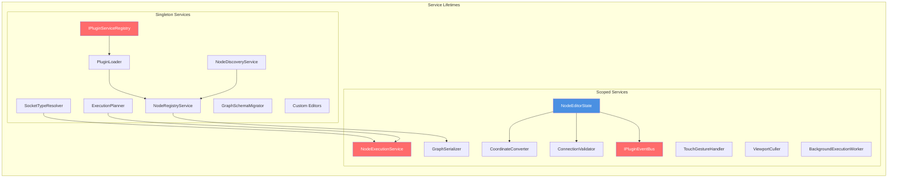

### Service Registration Pattern

```csharp
services.AddNodeEditor() registers:

Singleton Services (shared across application):
├── PluginLoader - manages plugin lifecycle
├── IPluginServiceRegistry - plugin service providers
├── NodeRegistryService - node definition catalog
├── NodeDiscoveryService - discovers nodes from assemblies
├── SocketTypeResolver - type compatibility checking
├── ExecutionPlanner - execution order planning
├── GraphSchemaMigrator - schema version migration
└── Custom Editors - text, numeric, bool editors

Scoped Services (per user/circuit):
├── NodeEditorState - central state management
├── IPluginEventBus - plugin event subscriptions
├── CoordinateConverter - screen/graph coordinate translation
├── ConnectionValidator - connection validation logic
├── TouchGestureHandler - touch/gesture processing
├── ViewportCuller - visibility optimization
├── NodeExecutionService - node execution orchestration
├── GraphSerializer - graph save/load
└── BackgroundExecutionWorker - async execution
```

---

## State Management

The `NodeEditorState` class is the **single source of truth** for the entire node graph.

```mermaid
graph TB
    subgraph "NodeEditorState"
        Nodes[Nodes Collection]
        Connections[Connections Collection]
        Selection[Selected Node IDs]
        SelConn[Selected Connection]
        Zoom[Zoom Level]
        Viewport[Viewport Position]
    end
    
    subgraph "Events Published"
        NodeAdded[NodeAdded]
        NodeRemoved[NodeRemoved]
        ConnAdded[ConnectionAdded]
        ConnRemoved[ConnectionRemoved]
        SelectionChanged[SelectionChanged]
        ConnSelChanged[ConnectionSelectionChanged]
        ViewportChanged[ViewportChanged]
        ZoomChanged[ZoomChanged]
        SocketValChanged[SocketValuesChanged]
        ExecStateChanged[NodeExecutionStateChanged]
        UndoReq[UndoRequested]
        RedoReq[RedoRequested]
    end
    
    Nodes --> NodeAdded
    Nodes --> NodeRemoved
    Connections --> ConnAdded
    Connections --> ConnRemoved
    Selection --> SelectionChanged
    SelConn --> ConnSelChanged
    Viewport --> ViewportChanged
    Zoom --> ZoomChanged
    
    Canvas[NodeEditorCanvas]
    ExecService[NodeExecutionService]
    
    Canvas -.subscribes.-> NodeAdded
    Canvas -.subscribes.-> ConnAdded
    Canvas -.subscribes.-> ViewportChanged
    
    ExecService -.subscribes.-> NodeAdded
    ExecService -.subscribes.-> ConnAdded
    
    Canvas --modifies--> Nodes
    Canvas --modifies--> Connections
    ExecService --updates--> ExecStateChanged
    
    style Nodes fill:#4a90e2,color:#fff
    style Events fill:#ff6b6b,color:#fff
```

### Key State Management Methods

```csharp
State Management API:
├── Graph Manipulation
│   ├── AddNode(NodeViewModel)
│   ├── RemoveNode(Guid nodeId)
│   ├── AddConnection(ConnectionData)
│   └── RemoveConnection(ConnectionData)
├── Selection Management
│   ├── SelectNode(Guid nodeId, bool additive)
│   ├── ToggleSelectNode(Guid nodeId)
│   ├── SelectNodes(IEnumerable<Guid>)
│   ├── ClearSelection()
│   └── SelectConnection(ConnectionData)
├── Viewport Management
│   ├── Zoom { get; set; }
│   └── Viewport { get; set; }
├── Execution State
│   ├── BuildExecutionNodes()
│   ├── ApplyExecutionContext(INodeExecutionContext)
│   ├── SetNodeExecuting(Guid nodeId)
│   ├── SetNodeError(Guid nodeId, string error)
│   └── ResetNodeExecutionState(Guid? nodeId)
└── History
    ├── RequestUndo()
    └── RequestRedo()
```

### Event Flow Pattern

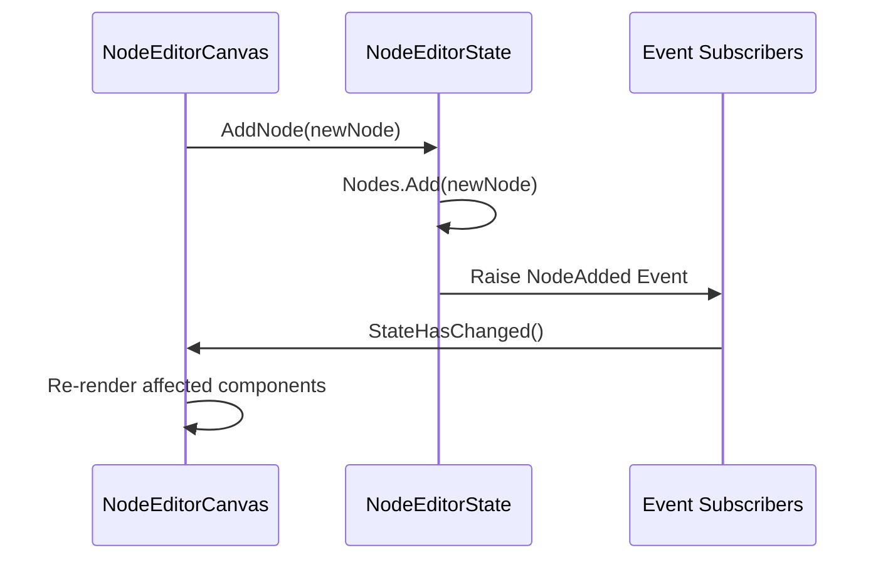

---

## Component Hierarchy

The Blazor component tree is structured to reflect the visual hierarchy of the editor:

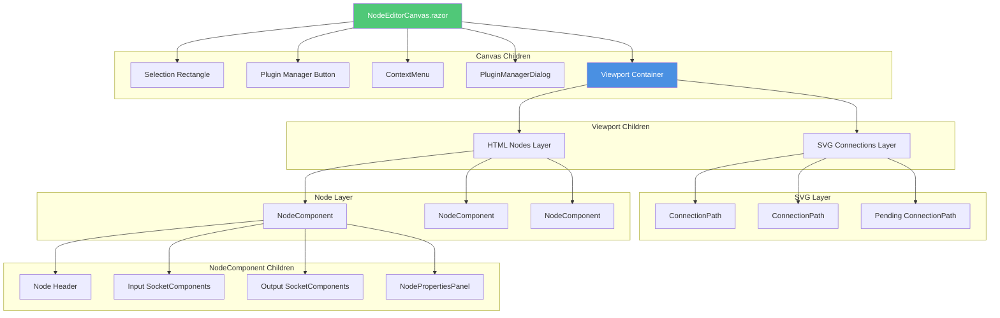

### Component Responsibilities

| Component | Purpose | Key Features |
|-----------|---------|--------------|
| **NodeEditorCanvas** | Root container, handles all user interactions | Pointer events, keyboard shortcuts, viewport transformation, culling |
| **NodeComponent** | Renders individual nodes | Drag handling, socket layout, selection state, execution state visualization |
| **SocketComponent** | Renders input/output sockets | Connection points, value editing, type indicators |
| **ConnectionPath** | Renders bezier curves between sockets | SVG path generation, selection handling, visual feedback |
| **ContextMenu** | Add node menu | Searchable node catalog, category filtering |
| **NodePropertiesPanel** | Socket value editors | Inline editing for disconnected inputs |

### Viewport Transform & Culling

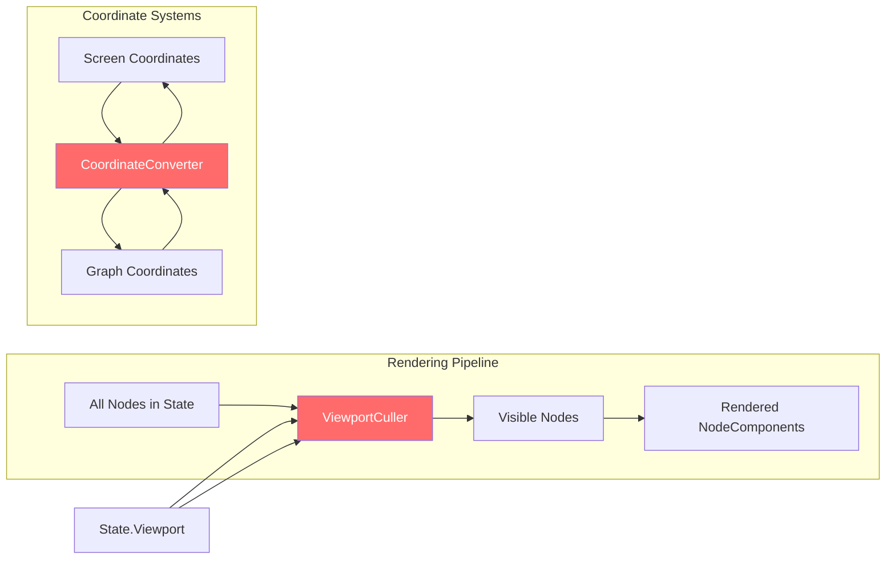

**Viewport Transform CSS:**
```css
transform: translate({X}px, {Y}px) scale({Zoom});
```

**Culling Strategy:**
- Only nodes within viewport bounds + margin are rendered
- Dramatically improves performance for large graphs
- Updated on viewport pan/zoom

---

## Registry & Plugin System

The registry system discovers, validates, and manages node definitions from assemblies.

```mermaid
graph TB
    subgraph "Plugin Discovery & Loading"
        PluginDir[Plugin Directory]
        Loader[PluginLoader]
        ServiceRegistry[IPluginServiceRegistry]
        Manifest[Plugin Manifest]
        Validation[Plugin Validation]
        LoadCtx[PluginLoadContext]
    end
    
    subgraph "Node Discovery"
        Assemblies[Assemblies]
        Discovery[NodeDiscoveryService]
        Reflection[Reflection Analysis]
        NodeDef[NodeDefinition]
    end
    
    subgraph "Registry"
        Registry[NodeRegistryService]
        Catalog[NodeCatalog]
        Definitions[Node Definitions Map]
    end
    
    subgraph "Node Providers"
        Standard[StandardNodeContext]
        Composite[CompositeNodeContext]
        Custom[Custom Contexts]
    end
    
    PluginDir --> Loader
    ServiceRegistry --> Loader
    Loader --> Manifest
    Manifest --> Validation
    Validation --> LoadCtx
    LoadCtx --> Assemblies
    
    Assemblies --> Discovery
    Discovery --> Reflection
    Reflection --> NodeDef
    NodeDef --> Registry
    
    Registry --> Catalog
    Registry --> Definitions
    
    Standard --> Discovery
    Composite --> Discovery
    Custom --> Discovery
    
    style Registry fill:#4a90e2,color:#fff
    style Discovery fill:#ff6b6b,color:#fff
```

## Plugin Lifecycle & Services

Plugins now support lifecycle hooks and scoped service registration. Each plugin can provide its own service provider via `IPluginServiceRegistry` and participate in editor lifecycle via `INodePlugin` hooks.

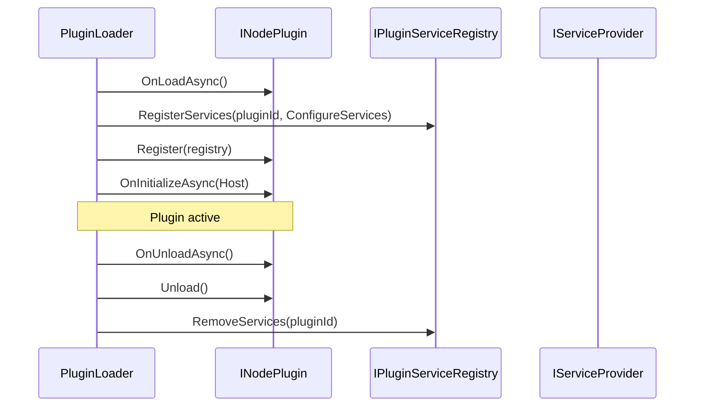

**Key Responsibilities**

- **`OnLoadAsync()`**: initialize resources after assembly load
- **`ConfigureServices()`**: register plugin-owned services
- **`Register()`**: register node definitions
- **`OnInitializeAsync()`**: access host DI services
- **`OnUnloadAsync()` / `Unload()`**: cleanup and shutdown

---

## Plugin Event Bus

Plugins can subscribe to editor state changes through `IPluginEventBus`, which is wired to `NodeEditorState` and registered as a scoped service. This provides a safe way for plugins to react to graph changes without coupling directly to UI components.

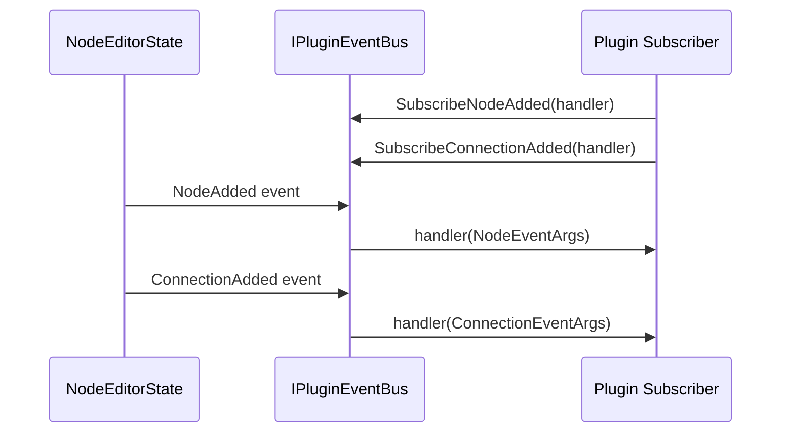

**Covered Events**

- `NodeAdded`
- `NodeRemoved`
- `ConnectionAdded`
- `ConnectionRemoved`
- `SelectionChanged`
- `ConnectionSelectionChanged`
- `ViewportChanged`
- `ZoomChanged`
- `SocketValuesChanged`
- `NodeExecutionStateChanged`

When the event bus is disposed, it unhooks from `NodeEditorState` to avoid memory leaks.

---

### Node Definition Structure

```csharp
NodeDefinition:
├── Id: string                    // Unique identifier
├── Name: string                  // Display name
├── Category: string              // Category for organization
├── Color: ColorValue             // Visual styling
├── Icon: string                  // SVG icon path
├── Description: string           // Tooltip/help text
├── MethodName: string            // Method to invoke
├── ContextType: Type             // Class containing method
├── Parameters: List<SocketData>  // Input definitions
└── Outputs: List<SocketData>     // Output definitions
```

### Plugin Loading Flow

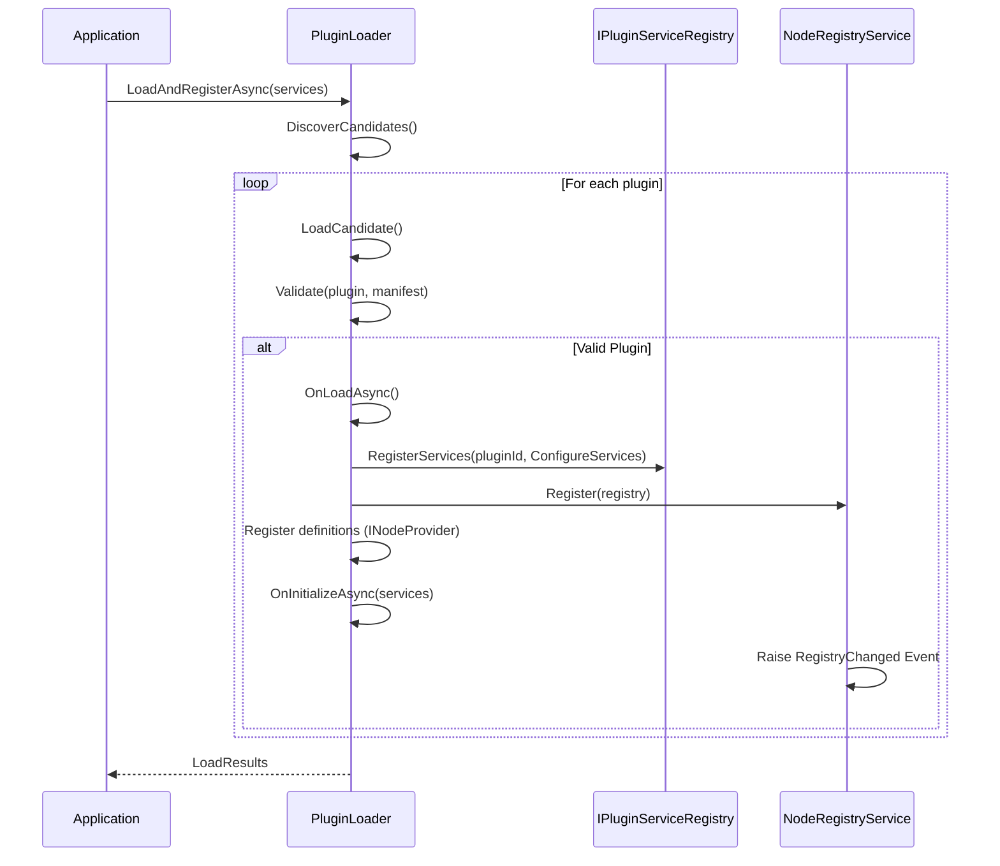

### Node Discovery Process

The system uses **reflection** to find methods decorated with `[Node]` attribute:

```csharp
Discovery Process:
1. Scan assemblies for classes implementing INodeContext
2. Find public methods with [Node] attribute
3. Extract method signature (parameters → inputs, return → outputs)
4. Generate NodeDefinition with:
   - Socket definitions from parameter types
   - Execution socket (if async or has await)
   - Metadata from attribute properties
5. Register with NodeRegistryService
```

**Example Node Declaration:**
```csharp
public class StandardNodeContext : INodeContext
{
    [Node(Category = "Math", Color = "#4CAF50")]
    public int Add(int a, int b)
    {
        return a + b;
    }
}
```

Becomes:
```
NodeDefinition {
  Id: "StandardNodeContext.Add"
  Category: "Math"
  Color: "#4CAF50"
  Inputs: [
    SocketData { Name: "a", Type: "System.Int32" },
    SocketData { Name: "b", Type: "System.Int32" }
  ]
  Outputs: [
    SocketData { Name: "Result", Type: "System.Int32" }
  ]
}
```

---

## Execution Engine

The execution engine orchestrates the evaluation of node graphs with support for parallel and sequential execution modes.

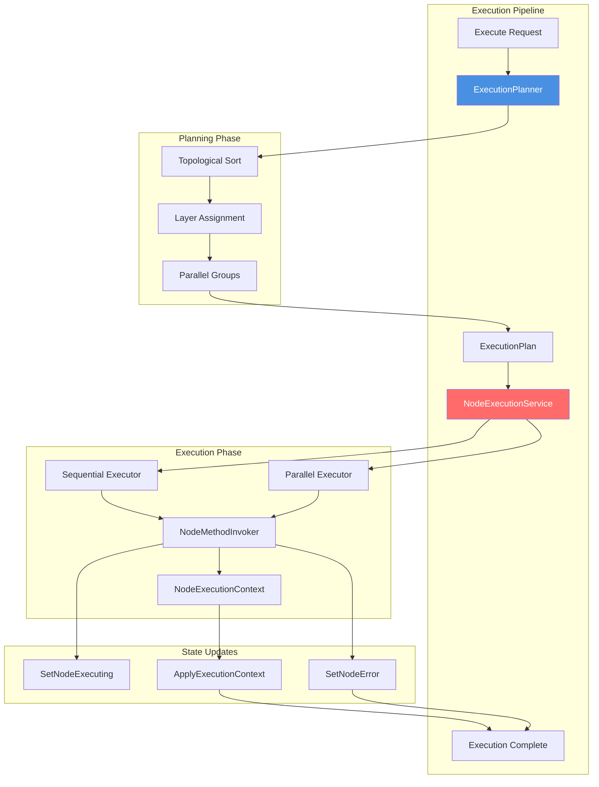

### Execution Modes

| Mode | Description | Use Case |
|------|-------------|----------|
| **Sequential** | Executes layers one at a time, nodes within layer in parallel | Default mode, ensures execution order |
| **Parallel** | Executes all independent nodes simultaneously | Maximum performance, order-independent graphs |
| **Planned** | Uses pre-computed execution plan | Repeated execution of same graph structure |

### Execution Planning

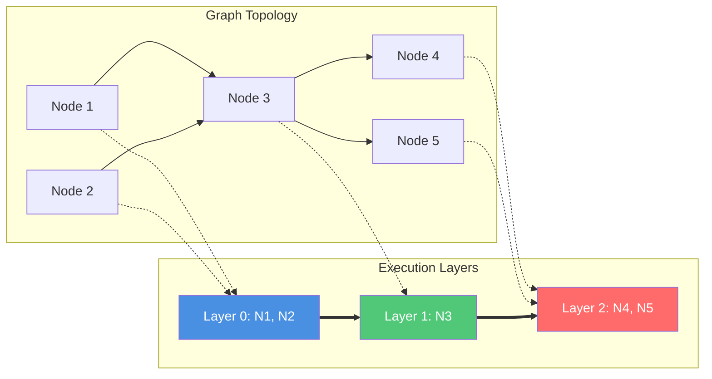

**Planning Algorithm:**
```
1. Build dependency graph from connections
2. Perform topological sort to find valid execution order
3. Assign nodes to layers:
   - Layer 0: nodes with no dependencies
   - Layer N: nodes depending only on layers 0..N-1
4. Nodes within same layer can execute in parallel
```

### Node Execution Flow

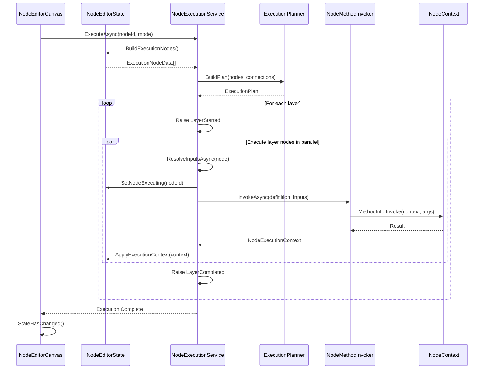

### Input Resolution

Before executing a node, the system resolves all input values:

```csharp
Input Resolution Strategy:
1. Check if socket has incoming connection
   YES → Get value from connected output socket
   NO  → Use socket's default/stored value
2. Perform type conversion if needed
3. Handle ExecutionPath sockets specially:
   - Determine next execution node
   - Manage execution flow control
```

### Execution Context

Each node execution receives a `NodeExecutionContext`:

```csharp
NodeExecutionContext:
├── NodeId: Guid                          // Current node
├── Inputs: Dictionary<string, object?>   // Resolved input values
├── Outputs: Dictionary<string, object?>  // Populated by node
├── Error: string?                        // Error message if failed
├── IsSuccess: bool                       // Execution status
└── ExecutionTime: TimeSpan               // Performance tracking
```

---

## Serialization System

The serialization system handles saving and loading graphs with schema migration support.

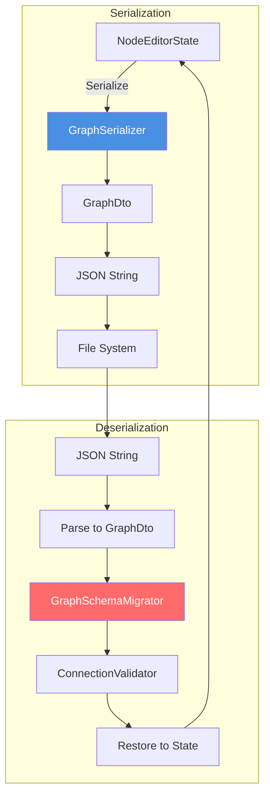

### GraphDto Structure

```csharp
GraphDto:
├── Version: int                      // Schema version
├── Nodes: List<NodeData>
│   ├── Id: Guid
│   ├── DefinitionId: string         // Maps to NodeDefinition
│   ├── Position: Point2D
│   ├── Inputs: List<SocketData>
│   └── Outputs: List<SocketData>
├── Connections: List<ConnectionData>
│   ├── Id: Guid
│   ├── SourceNodeId: Guid
│   ├── SourceSocket: string         // Socket name
│   ├── TargetNodeId: Guid
│   └── TargetSocket: string
└── Metadata: Dictionary<string, object>
```

### Schema Migration


**Migration Process:**
```csharp
Migration Pipeline:
1. Detect graph version from JSON
2. Apply migrations sequentially:
   - V1→V2: Added socket type information
   - V2→V3: Added execution path support
   - V3→V4: Added composite nodes
3. Validate all connections after migration
4. Return GraphImportResult with:
   - Migrated graph data
   - List of warnings/errors
   - Success status
```

### Serialization API

```csharp
GraphSerializer Methods:
├── SerializeAsync(NodeEditorState)
│   └── Returns: Task<string> (JSON)
├── DeserializeAsync(string json)
│   └── Returns: Task<GraphImportResult>
├── ExportAsync(NodeEditorState, string path)
│   └── Writes to file
└── ImportAsync(string path)
    └── Loads from file
```

---

## Data Flow

### Complete User Interaction Flow

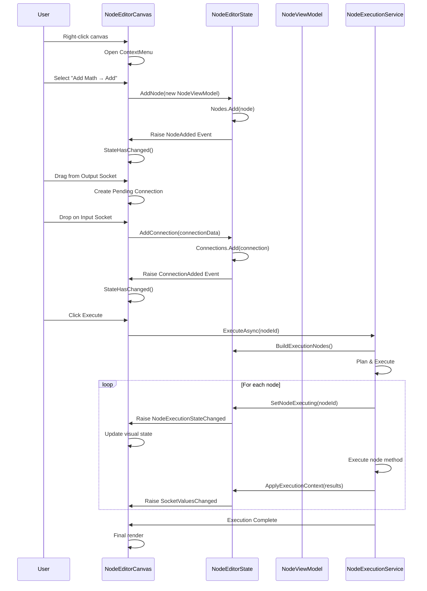

### Connection Validation Flow

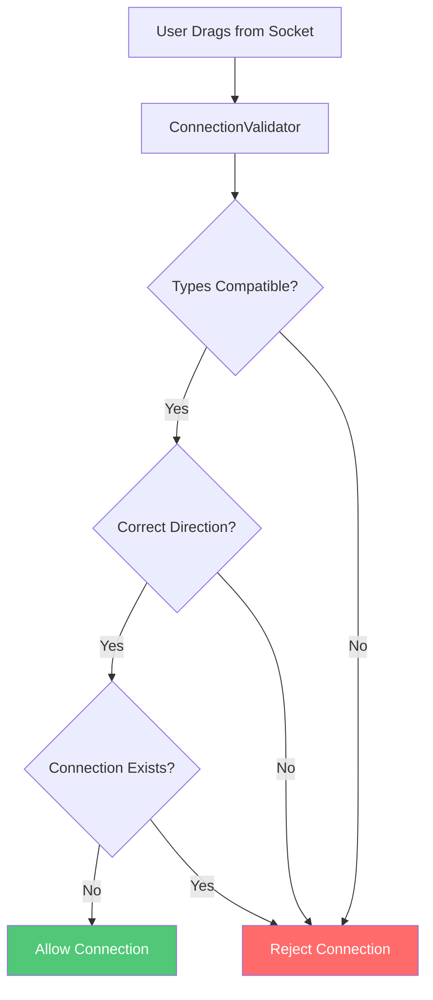

**Validation Rules:**
```csharp
Connection is valid if:
1. Types are compatible (exact match or assignable)
2. Direction is correct (output → input)
3. No duplicate connection exists
4. Not connecting node to itself
5. Input socket accepts connections (some are constant-only)
```

---

## Key Design Patterns

### 1. Event-Based Architecture
- **State** publishes events when data changes
- **Components** subscribe and react with UI updates
- Decouples state management from presentation

### 2. MVVM (Model-View-ViewModel)
- **Model**: `NodeData`, `ConnectionData`, `SocketData`
- **ViewModel**: `NodeViewModel`, `SocketViewModel`
- **View**: Razor components
- Clear separation enables testing and maintains clean boundaries

### 3. Service Locator via DI
- All services registered through `IServiceCollection`
- Components receive dependencies via `@inject`
- Enables mocking for unit tests

### 4. Plugin Architecture
- Dynamic assembly loading via `AssemblyLoadContext`
- Interface-based contracts (`INodeContext`, `INodePlugin`)
- Isolated plugin contexts prevent interference

### 5. Strategy Pattern
- Multiple execution strategies (Sequential, Parallel, Planned)
- Pluggable custom editors (`INodeCustomEditor`)
- Extensible marketplace sources (`IPluginMarketplaceSource`)

### 6. Repository Pattern
- `NodeRegistryService` manages node definitions
- Centralized access to node catalog
- Supports runtime registration of new nodes

---

## Performance Optimizations

### Viewport Culling
```csharp
ViewportCuller:
- Only renders nodes within visible viewport bounds
- Adds margin for smooth scrolling experience
- Dramatically reduces DOM size for large graphs
- Updates culling rect on pan/zoom
```

### Connection Rendering
```csharp
SVG Layer:
- All connections rendered in single SVG element
- Hardware-accelerated by browser
- Bezier curves for smooth appearance
- Conditional rendering for pending connections
```

### Event Throttling
```csharp
Touch/Mouse Events:
- Throttled viewport updates
- Batch state changes where possible
- Debounced resize handlers
```

### Lazy Loading
```csharp
Plugin System:
- Plugins loaded on-demand
- Assemblies unloadable for hot reload
- Manifest-based discovery before full load
```

---

## Extension Points

### 1. Custom Nodes
Implement `INodeContext` and decorate methods with `[Node]`:

```csharp
public class MyCustomNodes : INodeContext
{
    [Node(Category = "Custom", Color = "#FF5722")]
    public async Task<string> FetchDataAsync(string url)
    {
        // Implementation
    }
}
```

### 2. Custom Socket Editors
Implement `INodeCustomEditor`:

```csharp
public class DatePickerEditor : INodeCustomEditor
{
    public bool CanEdit(SocketData socket)
        => socket.TypeName == typeof(DateTime).FullName && socket.IsInput && !socket.IsExecution;
    
    public RenderFragment Render(SocketEditorContext context)
    {
        // Return Blazor RenderFragment
    }
}
```

### 3. Custom Marketplace Sources
Implement `IPluginMarketplaceSource`:

```csharp
public class CustomMarketplace : IPluginMarketplaceSource
{
    public async Task<List<MarketplacePluginInfo>> GetAvailablePluginsAsync()
    {
        // Fetch from custom source
    }
}
```

### 4. Custom Serialization
Extend `GraphSerializer` for custom formats:

```csharp
public class CustomSerializer : GraphSerializer
{
    // Override methods for custom serialization logic
}
```

---

## Testing Strategy

### Unit Tests
- **Service Layer**: Mock dependencies, test business logic
- **ViewModels**: Test property change notifications
- **Validators**: Test connection rules
- **Serializer**: Test save/load with various schemas

### Integration Tests
- **Execution Engine**: Full graph execution scenarios
- **Plugin Loading**: Load and register test plugins
- **State Management**: Multi-step state changes

### Component Tests (bUnit)
- **NodeComponent**: Rendering, drag behavior
- **SocketComponent**: Connection interactions
- **NodeEditorCanvas**: Viewport transformations

---

## Future Enhancements

1. **Undo/Redo System**: Command pattern implementation
2. **Graph Templates**: Pre-built node graph libraries
3. **Debugging Tools**: Breakpoints, step execution
4. **Performance Profiler**: Node execution timing visualization
5. **Collaborative Editing**: Real-time multi-user support
6. **WebAssembly Support**: Client-side execution
7. **Custom Layout Algorithms**: Auto-arrange nodes
8. **Expression Evaluation**: Inline formula nodes

---

## Conclusion

NodeEditor.Blazor provides a robust, extensible foundation for building visual node-based editors. The event-driven architecture ensures reactive UI updates, while the plugin system allows unlimited extensibility. The execution engine supports complex workflows with parallel execution, and the serialization system ensures graphs can be saved and migrated across versions.

For implementation details, see the source code and unit tests in the repository.
