# NodeEditor.Blazor Wiring & Event Flow Guide

## Overview

This document provides detailed insight into how NodeEditor.Blazor components are wired together, how events flow through the system, and how the reactive architecture responds to user interactions.

---

## Table of Contents

1. [Dependency Injection Wiring](#dependency-injection-wiring)
2. [Component Event Propagation](#component-event-propagation)
3. [State Change Propagation](#state-change-propagation)
4. [Connection Creation Flow](#connection-creation-flow)
5. [Node Execution Flow](#node-execution-flow)
6. [Plugin Loading & Registration Flow](#plugin-loading--registration-flow)
7. [Plugin Lifecycle Hooks](#plugin-lifecycle-hooks)
8. [Plugin Event Bus](#plugin-event-bus)
9. [Serialization & Deserialization Flow](#serialization--deserialization-flow)
10. [Viewport & Coordinate Transformation](#viewport--coordinate-transformation)

---

## Dependency Injection Wiring

### Service Registration Graph

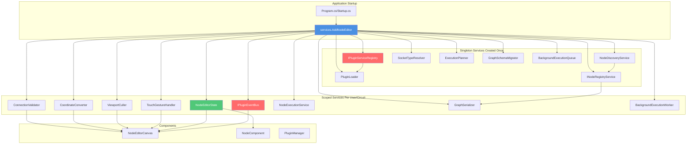

### Injection into Components

Each Blazor component declares dependencies at the top:

```razor
@inject NodeEditorState State
@inject CoordinateConverter CoordinateConverter
@inject ConnectionValidator ConnectionValidator
@inject IJSRuntime JSRuntime
```

Plugin-aware components and services can also inject:

```razor
@inject IPluginEventBus PluginEventBus
```

**Wiring Flow:**

1. **Application Start**: `services.AddNodeEditor()` is called
2. **Service Registration**: All services are registered with appropriate lifetimes
3. **Component Creation**: When Blazor instantiates a component, it injects dependencies
4. **OnInitialized**: Components subscribe to service events
5. **OnDispose**: Components unsubscribe to prevent memory leaks

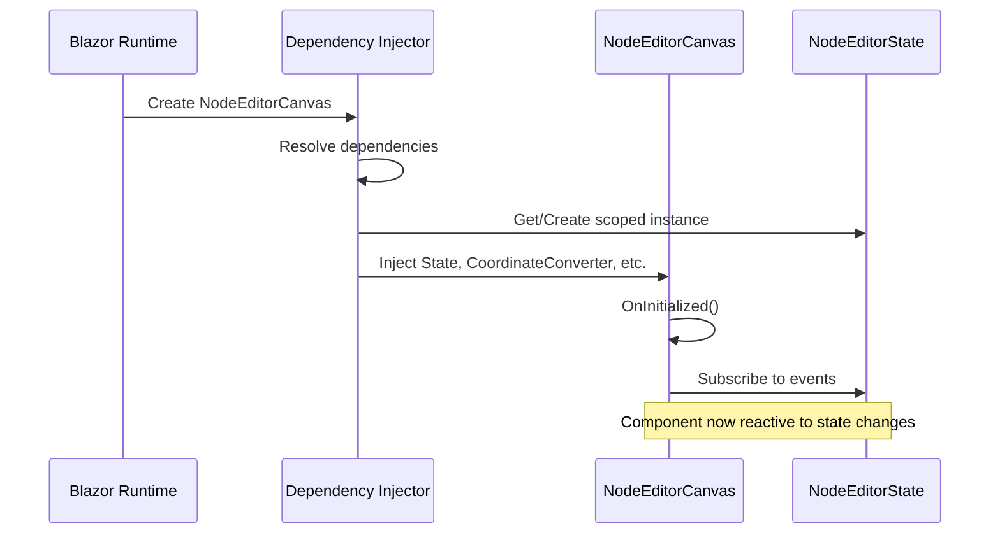

---

## Component Event Propagation

### User Interaction to State Update

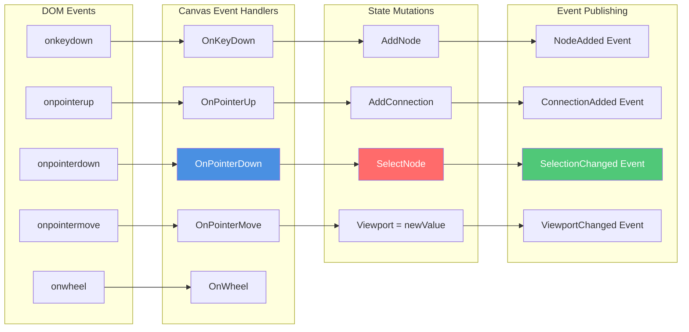

### Component-to-Component Communication

Components **never communicate directly**. All communication flows through **NodeEditorState**:

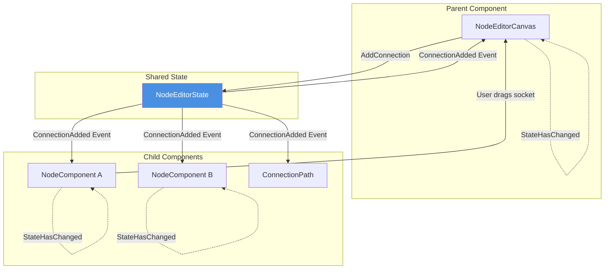

### Event Subscription Pattern

```csharp
// In NodeEditorCanvas.razor.cs
protected override void OnInitialized()
{
    // Subscribe to all relevant state events
    State.NodeAdded += OnNodeAdded;
    State.NodeRemoved += OnNodeRemoved;
    State.ConnectionAdded += OnConnectionAdded;
    State.ConnectionRemoved += OnConnectionRemoved;
    State.ViewportChanged += OnViewportChanged;
    State.ZoomChanged += OnZoomChanged;
    State.SelectionChanged += OnSelectionChanged;
}

private void OnNodeAdded(object? sender, StateChangeEventArgs<NodeViewModel> e)
{
    // Update culling, refresh visible nodes
    UpdateVisibleNodes();
    StateHasChanged(); // Trigger Blazor re-render
}

public void Dispose()
{
    // CRITICAL: Unsubscribe to prevent memory leaks
    State.NodeAdded -= OnNodeAdded;
    State.NodeRemoved -= OnNodeRemoved;
    // ... unsubscribe all
}
```

---

## State Change Propagation

### How State Changes Trigger UI Updates

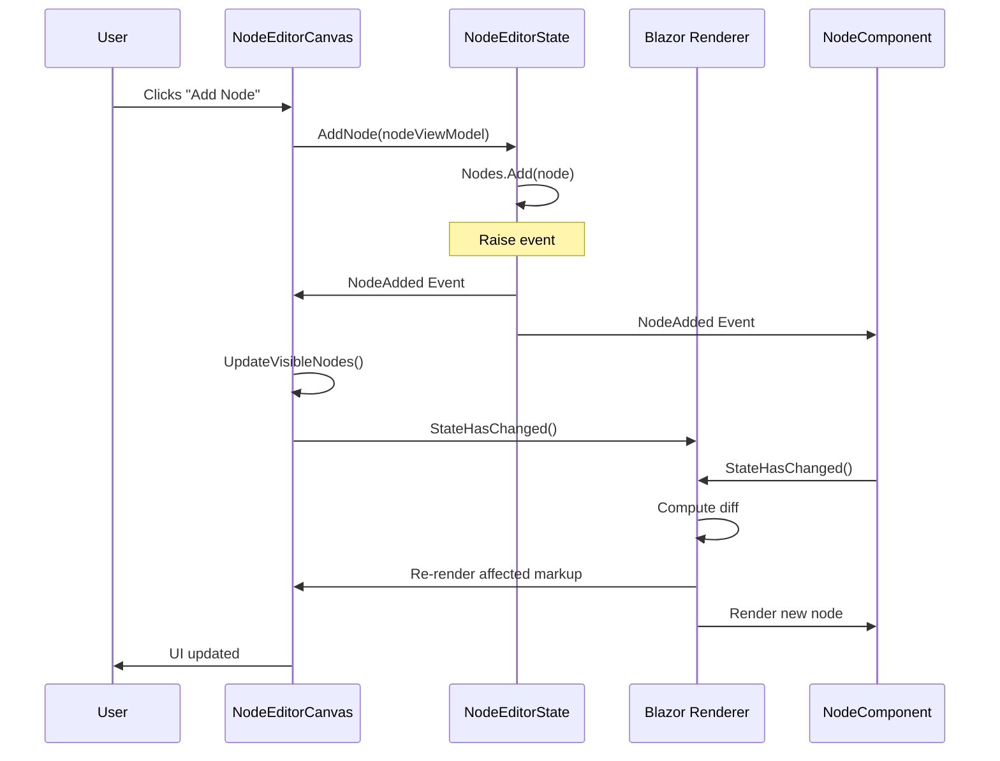

### Event Cascading

When one state change triggers multiple reactions:

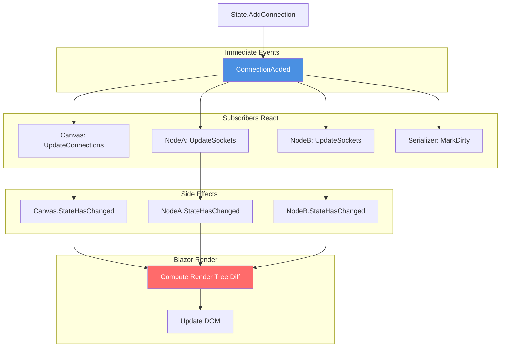

---

## Connection Creation Flow

### Complete Connection Creation Sequence

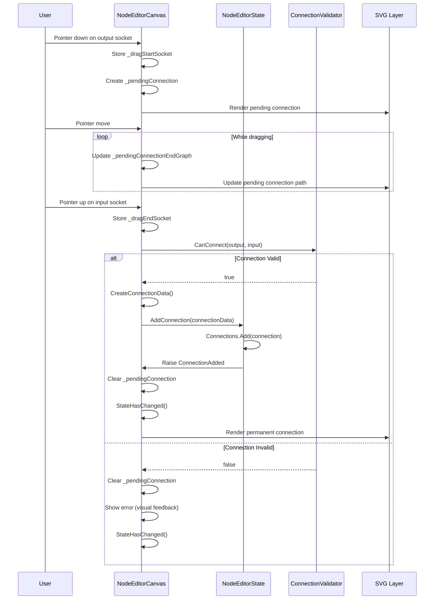

### Validation Rules Applied

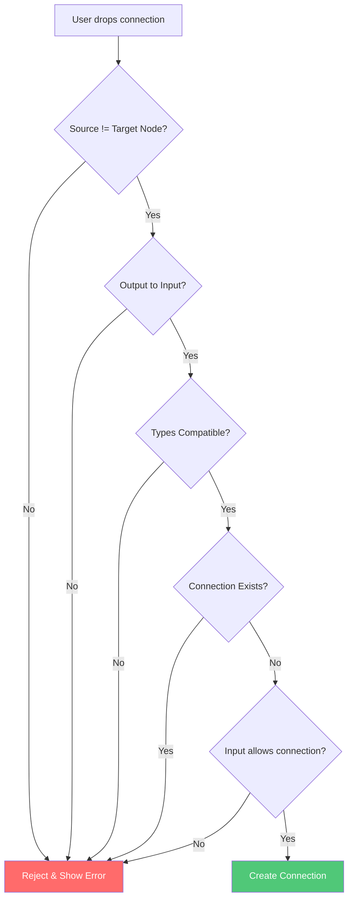

**Type Compatibility:**

```csharp
SocketTypeResolver checks:
1. Exact type match: int → int ✓
2. Assignable types: IEnumerable<T> → List<T> ✓
3. Base/derived: object → string ✓
4. Incompatible: int → string ✗
```

---

## Node Execution Flow

### End-to-End Execution Sequence

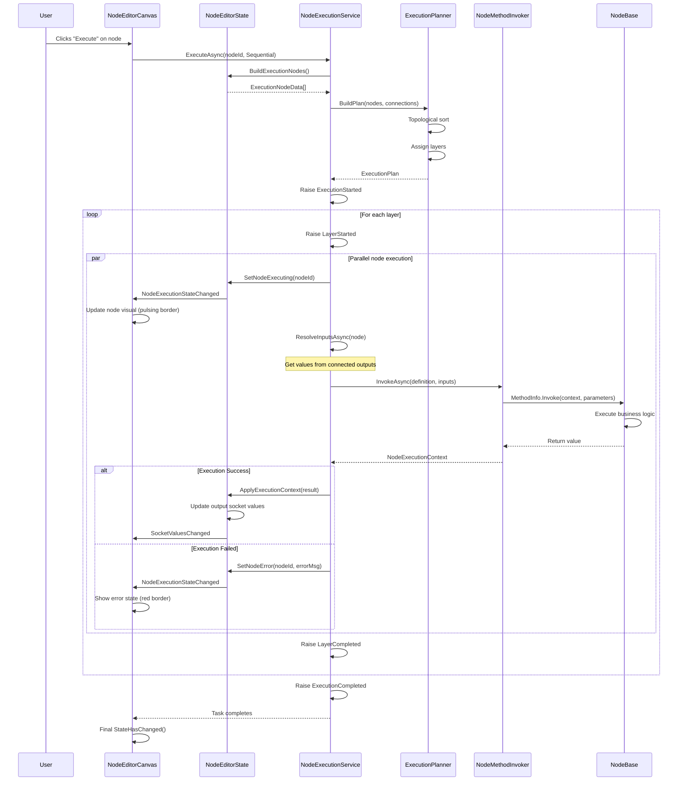

### Input Resolution Strategy

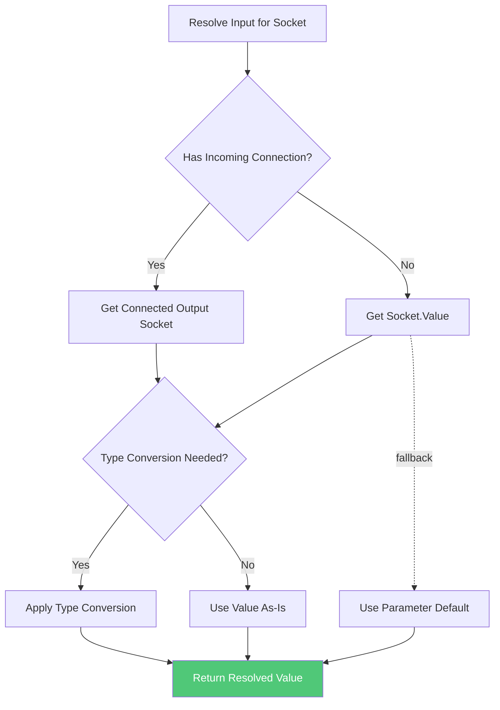

### Execution State Visualization

The UI reflects execution state in real-time:

| State | Visual Indicator | CSS Class |
|-------|-----------------|-----------|
| **Idle** | Normal appearance | `.ne-node` |
| **Executing** | Pulsing blue border | `.ne-node.executing` |
| **Success** | Brief green flash | `.ne-node.success` |
| **Error** | Red border + error icon | `.ne-node.error` |

```css
.ne-node.executing {
    animation: pulse 1.5s infinite;
    border-color: #4a90e2;
}

.ne-node.error {
    border-color: #ff6b6b;
    box-shadow: 0 0 10px rgba(255, 107, 107, 0.5);
}
```

---

## Plugin Loading & Registration Flow

### Complete Plugin Lifecycle

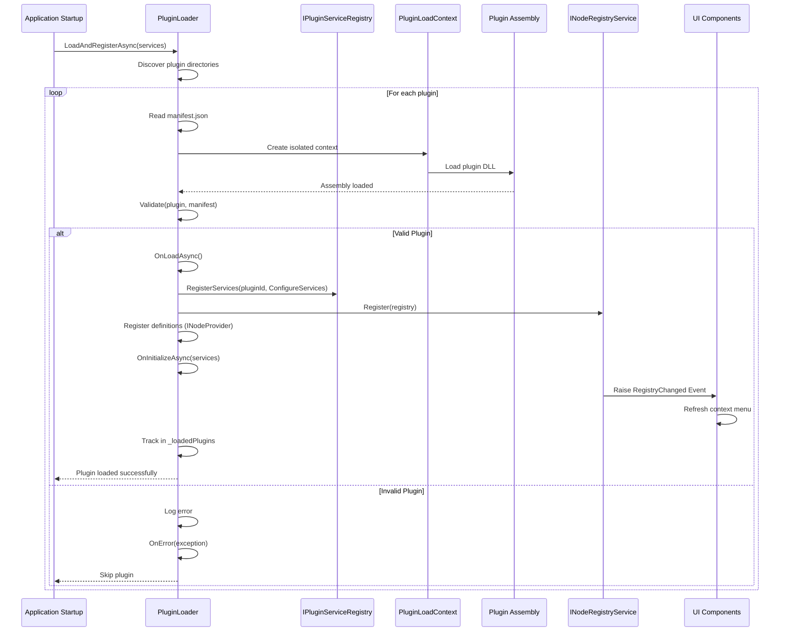

### Plugin Manifest Structure

```json
{
  "pluginId": "com.example.myplugin",
  "name": "My Custom Plugin",
  "version": "1.0.0",
  "author": "Your Name",
  "description": "Adds custom nodes for data processing",
  "mainAssembly": "MyPlugin.dll",
  "dependencies": [
    {
      "name": "Newtonsoft.Json",
      "version": "13.0.0"
    }
  ]
}
```

### Registry Update Flow

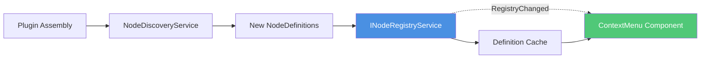

**When a plugin is loaded:**

1. **Lifecycle** runs: `OnLoadAsync()` → `ConfigureServices()`
2. **Registry** receives node definitions (via `Register()` and optional `INodeProvider`)
3. **Initialization** runs: `OnInitializeAsync()`
4. **Event** is raised: `RegistryChanged`
5. **ContextMenu** refreshes its node catalog
6. **User** sees new nodes in add menu

---

## Plugin Lifecycle Hooks

Plugins now support explicit lifecycle hooks and service registration. The loader calls them in order:

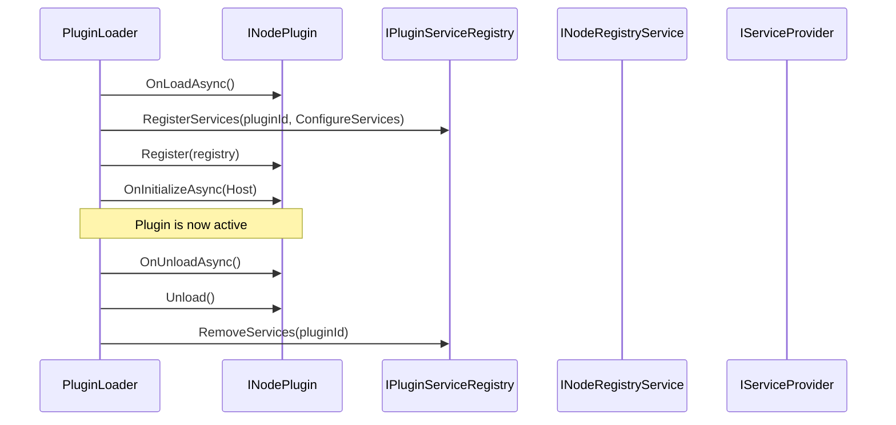

### Lifecycle Guarantees

- `OnLoadAsync()` is called after the assembly is loaded and validated.
- `ConfigureServices()` is invoked to register plugin services into a plugin-owned service provider.
- `Register()` is called to register node definitions with the registry.
- `OnInitializeAsync()` is called with the host `IServiceProvider` (use for shared services).
- `OnUnloadAsync()` runs before `Unload()` and before unloading the plugin context.

---

## Plugin Event Bus

Plugins can subscribe to editor events using `IPluginEventBus` (scoped). It is wired to `NodeEditorState` events.

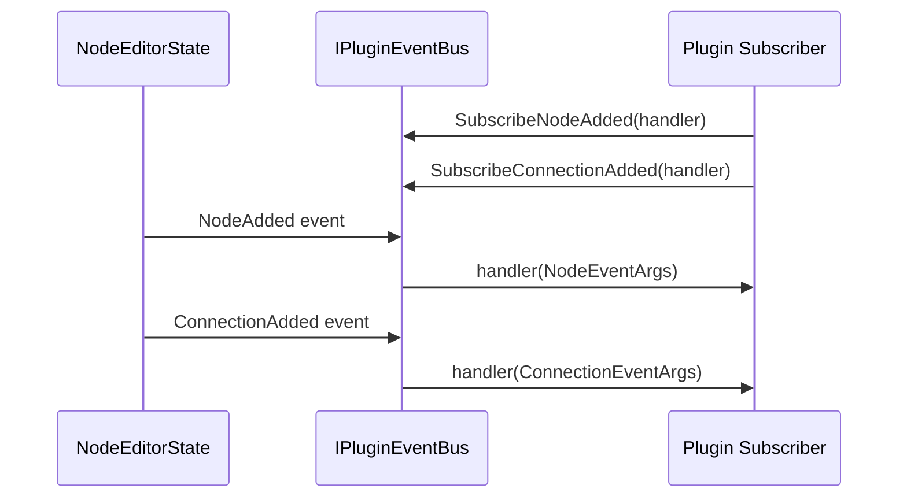

### Event Coverage

The event bus publishes all core state changes:

- `NodeAdded`
- `NodeRemoved`
- `ConnectionAdded`
- `ConnectionRemoved`
- `SelectionChanged`
- `ConnectionSelectionChanged`
- `ViewportChanged`
- `ZoomChanged`
- `SocketValuesChanged`
- `NodeExecutionStateChanged`

When the bus is disposed, it unhooks from `NodeEditorState` to avoid memory leaks.

---

## Serialization & Deserialization Flow

### Save Graph Flow

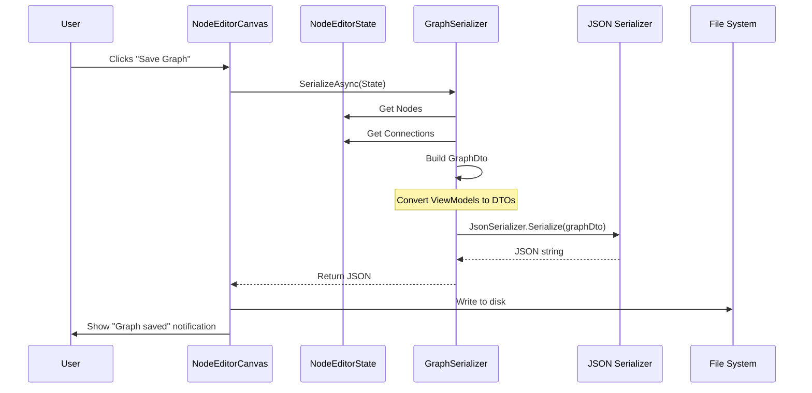

### Load Graph Flow with Migration

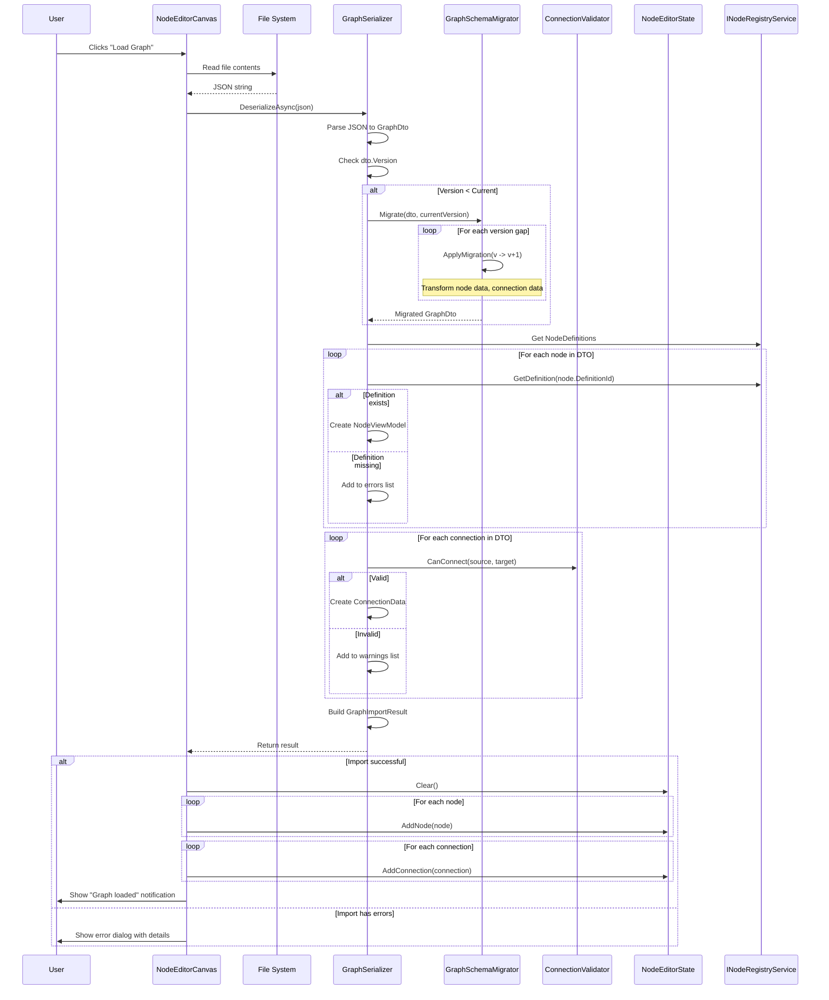

### Schema Migration Example

**Migration from V2 to V3** (adding execution path support):

```csharp
V2 GraphDto:
{
  "version": 2,
  "nodes": [
    {
      "id": "node-1",
      "definitionId": "Add",
      "inputs": [
        { "name": "a", "value": 5 },
        { "name": "b", "value": 3 }
      ],
      "outputs": [
        { "name": "Result" }
      ]
    }
  ]
}

V3 GraphDto (after migration):
{
  "version": 3,
  "nodes": [
    {
      "id": "node-1",
      "definitionId": "Add",
      "inputs": [
        { "name": "a", "value": 5, "type": "System.Int32" },
        { "name": "b", "value": 3, "type": "System.Int32" },
        { "name": "In", "type": "ExecutionPath" }  // ← ADDED
      ],
      "outputs": [
        { "name": "Result", "type": "System.Int32" },
        { "name": "Out", "type": "ExecutionPath" }  // ← ADDED
      ]
    }
  ]
}
```

---

## Viewport & Coordinate Transformation

### Coordinate System Translation

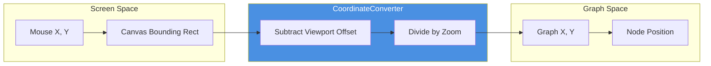

### Screen to Graph Conversion

```csharp
// User clicks at screen position (500, 300)
// Viewport is at (-1000, -500)
// Zoom is 1.5

ScreenToGraph(Point2D screenPos)
{
    // 1. Get canvas offset
    var canvasRect = await GetBoundingClientRect();
    
    // 2. Adjust for canvas position
    var relativeX = screenPos.X - canvasRect.Left;
    var relativeY = screenPos.Y - canvasRect.Top;
    
    // 3. Account for viewport pan
    var graphX = (relativeX / Zoom) - Viewport.X;
    var graphY = (relativeY / Zoom) - Viewport.Y;
    
    return new Point2D(graphX, graphY);
}

// Example:
// (500 / 1.5) - (-1000) = 333.33 + 1000 = 1333.33
```

### Pan & Zoom Flow

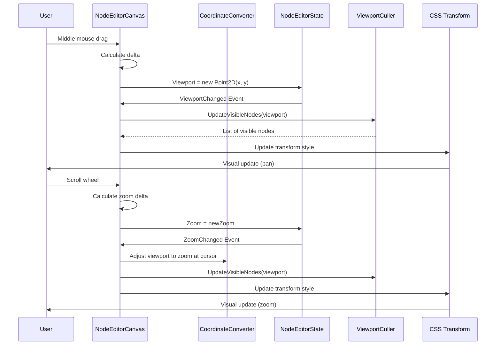

### Viewport Transform CSS

The viewport is transformed using CSS:

```css
.ne-viewport {
    transform: translate(${Viewport.X}px, ${Viewport.Y}px) scale(${Zoom});
    transform-origin: top left;
}
```

**Effect:**
- All child elements (nodes, connections) are transformed together
- Hardware-accelerated by GPU
- Smooth pan and zoom experience

### Viewport Culling Optimization

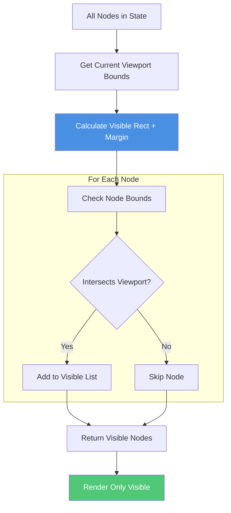

**Culling Benefits:**

- **Before**: 1000 nodes → 1000 DOM elements → slow rendering
- **After**: 1000 nodes → 50 visible → 50 DOM elements → fast rendering
- Only nodes in viewport (plus margin) are rendered
- Automatically updates on pan/zoom

---

## Event Debugging Tips

### Tracing Event Flow

```csharp
// Enable debug logging in NodeEditorState
protected void RaiseNodeAdded(NodeViewModel node)
{
    Console.WriteLine($"[STATE] NodeAdded: {node.Data.Id}");
    NodeAdded?.Invoke(this, new StateChangeEventArgs<NodeViewModel>(node));
}

// In component
private void OnNodeAdded(object? sender, StateChangeEventArgs<NodeViewModel> e)
{
    Console.WriteLine($"[CANVAS] Received NodeAdded: {e.Data.Data.Id}");
    UpdateVisibleNodes();
    StateHasChanged();
}
```

### Common Event Issues

| Issue | Cause | Solution |
|-------|-------|----------|
| **Events not firing** | No subscribers | Check `OnInitialized` subscriptions |
| **Multiple renders** | Multiple `StateHasChanged()` calls | Batch state changes, debounce |
| **Memory leaks** | Forgot to unsubscribe | Implement `IDisposable`, unsubscribe in `Dispose()` |
| **Stale state** | Reading cached value | Always access `State.Property` directly |

---

## Summary

NodeEditor.Blazor's wiring is built on these key principles:

1. **Centralized State**: `NodeEditorState` is the single source of truth
2. **Event-Driven**: All updates flow through events, never direct calls
3. **Dependency Injection**: Services are properly scoped and injected
4. **Reactive UI**: Components subscribe to state events and re-render automatically
5. **Isolated Concerns**: Each service has a single, clear responsibility

This architecture ensures:
- ✅ **Testability**: Mock dependencies easily
- ✅ **Maintainability**: Clear separation of concerns
- ✅ **Scalability**: Can handle large graphs efficiently
- ✅ **Extensibility**: Plugin system allows unlimited expansion
- ✅ **Performance**: Viewport culling and efficient rendering

Understanding these wiring patterns is essential for extending the framework or debugging issues.
