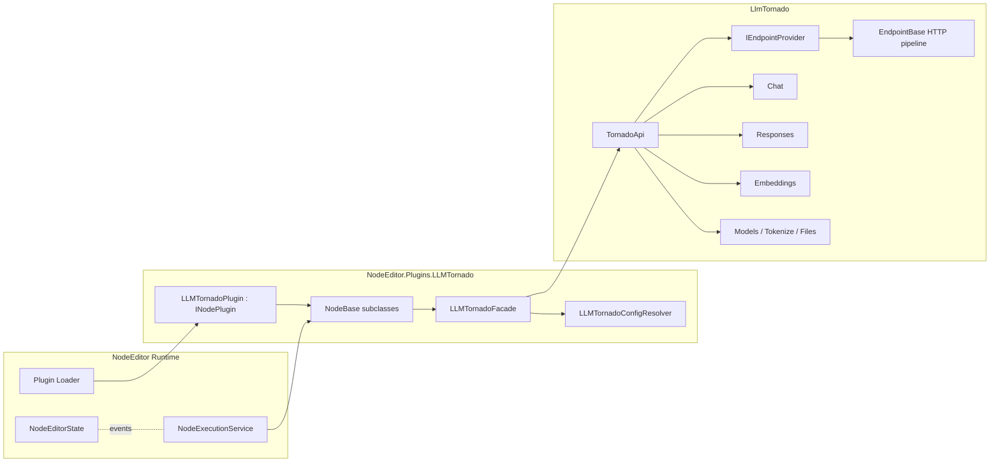

# NodeEditor.Plugins.LLMTornado — Design

**Version:** 2.0  
**Date:** 2026-02-12  
**Status:** Backend-aligned rewrite

---

## 1) Purpose

This document defines the plugin design after the LLMTornado backend rewrite.

The previous design assumed a mostly chat-only integration with custom orchestration layers. The rewritten backend now exposes a broader, provider-agnostic API surface with consistent endpoint patterns, provider routing, and richer streaming/event models. This design updates the plugin to match that architecture.

---

## 2) Backend Facts This Design Is Based On

The plugin design aligns with these backend characteristics:

- `TornadoApi` is the primary facade and owns:
  - provider authentications (`ConcurrentDictionary<LLmProviders, ProviderAuthentication>`)
  - endpoint providers (`ConcurrentDictionary<LLmProviders, IEndpointProvider>`)
  - lazy endpoint accessors (`Chat`, `Responses`, `Embeddings`, `Models`, `Tokenize`, etc.)
- Endpoint routing is provider-resolved through `IEndpointProvider` implementations created via `EndpointProviderConverter`.
- HTTP transport concerns are centralized in `EndpointBase`:
  - per-provider `HttpClient` reuse
  - optional hooks for client creation and request observation
  - configurable user-agent and request timeout
- API behavior supports two styles:
  - throwing methods (`CreateX`) for strict flow
  - safe methods (`CreateXSafe`) returning `HttpCallResult<T>`
- Streaming and event-based responses are first-class:
  - Chat streaming
  - Responses API event stream (`ResponseEventTypes` mapping)
- Tool invocation and structured output handling are built into chat/responses request processing.

---

## 3) Plugin Goals

1. Expose LLMTornado capabilities as NodeEditor nodes without duplicating backend logic.
2. Keep provider-specific behavior in LLMTornado provider layer, not in node UI code.
3. Support both simple and advanced workflows:
   - simple text prompt/response
   - structured requests
   - streaming and tool workflows
4. Preserve NodeEditor execution model:
   - async node execution
   - automatic `CancellationToken` injection
   - deterministic socket typing
5. Keep credentials out of graph data.

---

## 4) Non-Goals

- Re-implementing LLMTornado routing, serialization, or stream parsing inside the plugin.
- Building provider-specific node variants per vendor.
- Persisting secrets (API keys, org IDs) in graph JSON.

---

## 5) High-Level Architecture

### Layer responsibilities

- **Plugin entry (`INodePlugin`)**
  - registers services and node contexts
  - performs startup validation (non-fatal where possible)
- **Node classes (`NodeBase` subclasses)**
  - define sockets via `Configure(INodeBuilder)` and logic via `ExecuteAsync`
  - convert socket inputs into request DTOs
  - delegate all API calls to facade/service layer
- **Plugin facade/services**
  - construct/configure `TornadoApi`
  - apply provider/auth/runtime settings
  - normalize error/result mapping for nodes
- **LLMTornado backend**
  - provider routing, transport, streaming, schema/tool behavior

---

## 6) Service Design

### 6.1 `LLMTornadoConfigResolver`

Resolves runtime configuration from environment and/or host configuration.

Outputs:
- provider list + credentials
- optional `ApiUrlFormat` / `ApiVersion`
- optional request settings (user-agent override)
- runtime toggles (strict mode, direct browser access when explicitly enabled)

### 6.2 `LLMTornadoApiFactory`

Creates a correctly configured `TornadoApi` instance.

Rules:
- supports single-provider and multi-provider construction
- supports custom endpoint providers when configured
- does not persist secrets beyond process memory

### 6.3 `LLMTornadoFacade`

Thin orchestration layer used by nodes:

- `RunChatAsync(...)`
- `RunChatStreamAsync(...)`
- `RunResponseAsync(...)`
- `RunResponseStreamAsync(...)`
- `CreateEmbeddingsAsync(...)`
- utility operations (list models, tokenize)

This layer only adapts NodeEditor node IO to LLMTornado request/response contracts.

---

## 7) Node Surface (v2)

Node surface is intentionally compact and backend-aligned.

### 7.1 Chat

- **Simple Chat**
  - input: prompt/system/model/options
  - output: response text, usage, error
- **Chat Request (Advanced)**
  - input: structured request fields
  - output: full result object + convenience projections
- **Chat Stream**
  - output incremental deltas + final aggregate

### 7.2 Responses API

- **Create Response**
  - supports multimodal/tool-oriented response flows
- **Response Stream**
  - emits typed event stream categories (text deltas, tool events, completion/failure)

### 7.3 Embeddings

- **Embed Text** (single)
- **Embed Batch** (multiple inputs)

### 7.4 Utility

- **List Models**
- **Token Count / Tokenize**

> Additional endpoints (audio, images, OCR, rerank, batch, vector stores, etc.) can be added later without changing core plugin architecture.

---

## 8) Execution and Cancellation Model

- All callable nodes are `async` and accept `CancellationToken`.
- NodeEditor injects cancellation tokens automatically during execution.
- Tokens are passed through to LLMTornado requests so cancellation propagates to outbound calls/streams.
- Streaming nodes emit partial progress through state/event updates and finalize with deterministic outputs.

---

## 9) Error and Result Strategy

The plugin supports both strict and safe modes:

- **Strict path**: use throwing backend methods when graph should hard-fail on API errors.
- **Safe path**: use `HttpCallResult<T>` methods and expose:
  - `ok` flag
  - status/error payload
  - nullable result

Node outputs should always include a machine-usable status/error field so graphs can branch without parsing exception text.

---

## 10) Configuration & Security

### Configuration principles

- Runtime-only configuration (env vars / host config), not serialized into graph.
- Provider mapping allows multiple provider credentials in one runtime.
- Optional provider overrides at node level remain explicit and typed.

### Security principles

- Never store API keys in node/socket values that persist with graph JSON.
- Mask secrets in logs and diagnostics.
- Keep request/response logging opt-in and redacted.
- Only enable direct browser access headers when explicitly configured.

---

## 11) MCP and Tooling Interop

- Tool-call-capable nodes should rely on backend-native tool handling (chat/responses request pipelines).
- MCP-related capabilities should integrate through LLMTornado’s MCP adapter layer where needed, without duplicating protocol code in the plugin.
- NodeEditor’s own MCP state bridge remains a host concern; plugin nodes are runtime consumers.

---

## 12) Testing Strategy

### Unit tests

- request mapping from node inputs → LLMTornado request objects
- response/event mapping from LLMTornado results → node outputs
- provider/auth resolution behavior
- cancellation propagation

### Integration tests

- plugin registration/discovery of node definitions
- happy-path provider calls using test credentials/mocks
- streaming event flow completion and cancellation behavior

### Failure tests

- auth missing/invalid
- unsupported provider/model combinations
- network timeout and non-2xx responses

---

## 13) Migration Notes from Previous Design

What changed compared to the previous draft:

- Replaced speculative service layers with backend-aligned facade/factory/config resolver.
- Elevated **Responses API** to first-class node surface (not chat-only design).
- Standardized on provider-driven routing via `IEndpointProvider`.
- Simplified node catalog to a minimal, maintainable v2 surface.
- Removed assumptions that duplicated backend responsibilities.

---

## 14) Implementation Phases

1. **Foundation**
   - plugin entry + DI
   - config resolver + API factory
2. **Core nodes**
   - chat + responses + embeddings
3. **Streaming**
   - chat stream + responses event stream nodes
4. **Utility and hardening**
   - models/tokenize nodes, diagnostics, retry policy hooks
5. **Expansion (optional)**
   - audio/images/ocr/rerank/vector stores/batch node families

---

## 15) Open Decisions

1. Default execution mode per node: strict vs safe.
2. Whether streaming nodes publish raw backend events or normalized event categories only.
3. Scope of v2 MVP (core-only vs include selected multimodal endpoints).

---

## 16) Summary

This v2 design aligns the plugin with your rewritten backend by treating LLMTornado as the source of truth for provider routing, transport, streaming, and tool behavior. The plugin remains thin, typed, and NodeEditor-native, while exposing a practical node surface centered on chat, responses, embeddings, and streaming.
