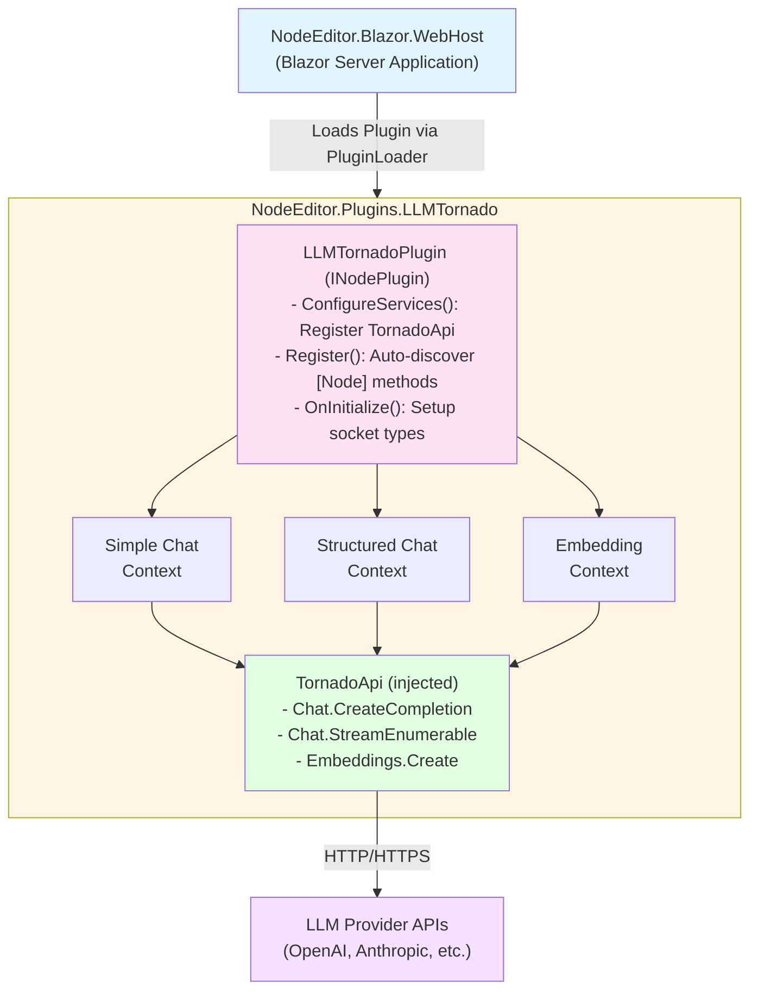
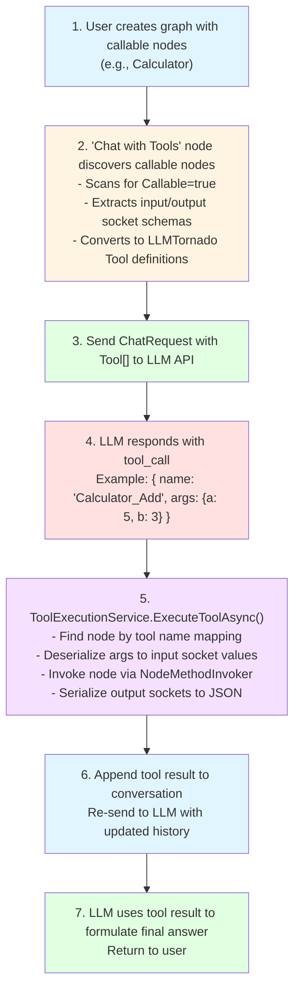

# LLMTornado Plugin for NodeEditor.Net - Design Document

**Version:** 1.0  
**Date:** February 8, 2026  
**Status:** Draft - Pending Approval

---

## Table of Contents

1. [Executive Summary](#executive-summary)
2. [Architecture Overview](#architecture-overview)
3. [Technical Requirements](#technical-requirements)
4. [Environment Configuration](#environment-configuration)
5. [Node Catalog](#node-catalog)
6. [Custom Data Types](#custom-data-types)
7. [Service Layer Design](#service-layer-design)
8. [UI Components](#ui-components)
9. [Streaming Implementation Strategy](#streaming-implementation-strategy)
10. [Tool Calling Architecture](#tool-calling-architecture)
11. [Error Handling & Retry Logic](#error-handling--retry-logic)
12. [Testing Strategy](#testing-strategy)
13. [Implementation Phases](#implementation-phases)
14. [File Structure](#file-structure)
15. [Dependencies](#dependencies)
16. [Security Considerations](#security-considerations)
17. [Performance Considerations](#performance-considerations)
18. [Open Questions & Decisions](#open-questions--decisions)

---

## Executive Summary

This document outlines the design for integrating the **LLMTornado** library into **NodeEditor.Net** as a comprehensive plugin. The plugin will expose LLM capabilities (chat completions, vision/multi-modal, embeddings, tool calling, streaming, MCP integration) as visual nodes, enabling users to build complex AI workflows through the node-based interface.

### Key Design Principles

1. **Dual Interface Strategy**: Provide both simple string-based nodes for beginners and structured message nodes for advanced users
2. **Vision Support**: Full support for multi-modal messages with images (vision-capable models like GPT-4 Vision, Claude 3, Gemini)
3. **Environment-Based Configuration**: API keys and provider settings sourced from system environment variables (not stored in graphs)
4. **Async-First Design**: All LLM operations use `async Task` methods, leveraging NodeEditor's execution engine support
5. **Progressive Enhancement**: Start with core features (chat, embeddings) and progressively add advanced capabilities (vision, streaming, tool calling, MCP)
6. **Type Safety**: Use strongly-typed socket connections with custom types where appropriate
7. **Visual Feedback**: Provide real-time execution status and streaming updates through the UI

---

## Architecture Overview

### System Context



### Component Responsibilities

| Component | Responsibility |
|-----------|----------------|
| **LLMTornadoPlugin** | Entry point; DI registration; plugin lifecycle |
| **Node Contexts** | Define node methods with `[Node]` attribute; execute LLM operations |
| **TornadoApi** | LLMTornado's main API facade; injected into nodes via DI |
| **Custom Editors** | Blazor components for enhanced socket editing (model picker, etc.) |
| **ToolExecutionService** | Discovers callable nodes; maps to function definitions; executes tool calls |
| **StreamingService** | Manages progressive token emission for streaming nodes |
| **ErrorHandler** | Retry policies; error categorization; diagnostics |

---

## Technical Requirements

### Supported .NET Version
- Target: **.NET 10** (aligned with NodeEditor.Net)

### LLMTornado Version
- Package: **LlmTornado** (latest stable from NuGet)
- Additional: **LlmTornado.Mcp** for MCP server integration

### NodeEditor Integration Points
- **INodePlugin**: Plugin registration and lifecycle
- **INodeContext**: Container for `[Node]` methods
- **ISocketTypeResolver**: Register custom socket types
- **NodeExecutionService**: Async execution support confirmed (Task-returning node methods)
- **NodeEditorState**: Event system for real-time UI updates
- **INodeCustomEditor**: Custom Blazor editors for sockets
- **CancellationToken**: Auto-injected parameter type (no socket created, engine provides automatically)

### Async Support Verification

From `NodeMethodInvoker.InvokeAsync` (lines 46-97):
```csharp
// Automatic CancellationToken injection
if (parameterType == typeof(CancellationToken))
{
    args[i] = token;  // Injected from execution context
    continue;         // No socket created
}

// Async support
var result = binding.Method.Invoke(binding.Target, args);

if (result is Task task)
{
    await task.ConfigureAwait(false);
}
```

✅ **Confirmed**: Node methods can return `Task` or `Task<T>`, and the execution engine will await them.
✅ **Confirmed**: `CancellationToken` parameters are auto-injected and don't create input sockets.

---

## Environment Configuration

### Required Environment Variables

```bash
# Primary API Configuration
LLMTORNADO_API_KEY=sk-...           # Main API key (OpenAI, Anthropic, etc.)
LLMTORNADO_PROVIDER=OpenAI          # Provider name (OpenAI, Anthropic, Cohere, etc.)
LLMTORNADO_ORGANIZATION=org-...     # Optional: Organization ID

# Multi-Provider Support (Optional)
LLMTORNADO_ANTHROPIC_KEY=sk-...
LLMTORNADO_COHERE_KEY=...
LLMTORNADO_GOOGLE_KEY=...

# Custom Endpoints (Optional)
LLMTORNADO_BASE_URL=https://...     # Override default provider endpoint

# MCP Configuration (Optional)
LLMTORNADO_MCP_SERVER_URI=http://localhost:3000
LLMTORNADO_MCP_TRANSPORT=http       # or "stdio"
```

### Configuration Service Design

```csharp
public class LLMTornadoConfiguration
{
    public string? ApiKey { get; set; }
    public string Provider { get; set; } = "OpenAI";
    public string? Organization { get; set; }
    public string? BaseUrl { get; set; }
    public Dictionary<string, string> ProviderKeys { get; set; } = new();
    
    public static LLMTornadoConfiguration FromEnvironment()
    {
        return new LLMTornadoConfiguration
        {
            ApiKey = Environment.GetEnvironmentVariable("LLMTORNADO_API_KEY"),
            Provider = Environment.GetEnvironmentVariable("LLMTORNADO_PROVIDER") ?? "OpenAI",
            Organization = Environment.GetEnvironmentVariable("LLMTORNADO_ORGANIZATION"),
            BaseUrl = Environment.GetEnvironmentVariable("LLMTORNADO_BASE_URL"),
            ProviderKeys = LoadProviderKeys()
        };
    }
}
```

### Security Principles

1. **Never serialize API keys in graph JSON**
2. **Configuration is runtime-only** (never persisted with graph data)
3. **Support environment variable overrides** at multiple levels
4. **Mask sensitive values** in UI and logs
5. **Validate credentials** before executing nodes

---

## Node Catalog

> **Note on CancellationToken:** All async node methods include a `CancellationToken` parameter. This is **automatically injected** by the execution engine and does **not create a visible input socket**. When execution is stopped/cancelled, the engine automatically signals cancellation to all running nodes. Node implementations should pass this token to LLM API calls for proper cancellation support.

### Simple Chat Nodes (String-Based)

#### 1. Simple Chat
**Category:** `LLM/Chat`  
**Description:** Send a single message and receive a response (no streaming)

```csharp
[Node("Simple Chat", 
      Category = "LLM/Chat", 
      Description = "Send a prompt to an LLM and get a text response",
      IsCallable = true)]
public async Task SimpleChatAsync(
    TornadoApi api,
    string Prompt,
    string? SystemMessage = null,
    string? Model = null,
    double? Temperature = null,
    int? MaxTokens = null,
    CancellationToken cancellationToken = default,
    out string Response,
    out int TokensUsed,
    out string Error,
    out ExecutionPath Next)
{
    // Implementation
}
```

**Inputs:**
- `Prompt` (string): User message
- `SystemMessage` (string, optional): System prompt
- `Model` (string, optional): Model name (e.g., "gpt-4")
- `Temperature` (double, optional): 0.0-2.0
- `MaxTokens` (int, optional): Max response length
- `cancellationToken` (CancellationToken): **Auto-injected, not visible as socket**

**Outputs:**
- `Response` (string): LLM response text
- `TokensUsed` (int): Total tokens consumed
- `Error` (string): Empty if success, error message otherwise
- `Next` (ExecutionPath): Flow control

---

#### 2. Simple Streaming Chat
**Category:** `LLM/Chat`  
**Description:** Stream tokens progressively as they arrive

```csharp
[Node("Simple Streaming Chat",
      Category = "LLM/Chat",
      Description = "Stream LLM responses token-by-token",
      IsCallable = true)]
public async Task SimpleStreamingChatAsync(
    TornadoApi api,
    string Prompt,
    string? SystemMessage = null,
    string? Model = null,
    CancellationToken cancellationToken = default,
    out string FinalResponse,
    out Action<string> OnTokenReceived, // Callback for progressive updates
    out ExecutionPath Next)
{
    // Implementation using IAsyncEnumerable StreamChatEnumerable
}
```

**Special Behavior:**
- `OnTokenReceived` callback fires for each token
- UI subscribes to streaming events and updates socket value in real-time
- `FinalResponse` emitted only after stream completes

---

### Structured Chat Nodes (ChatMessage-Based)

#### 3. Create Message
**Category:** `LLM/Messages`  
**Description:** Build a ChatMessage object with text content

```csharp
[Node("Create Message",
      Category = "LLM/Messages",
      Description = "Create a structured chat message with role and content")]
public void CreateMessage(
    string Role, // "system", "user", "assistant", "function"
    string Content,
    string? Name = null, // Optional: function name or participant ID
    out ChatMessage Message)
{
    Message = new ChatMessage(Role, Content) { Name = Name };
}
```

---

#### 3a. Create Image Part
**Category:** `LLM/Messages`  
**Description:** Create a message part containing an image

```csharp
[Node("Create Image Part",
      Category = "LLM/Messages",
      Description = "Create an image part for multi-modal messages")]
public void CreateImagePart(
    string ImageSource, // URL or base64-encoded data
    string? ImageDetail = "auto", // "auto", "low", "high"
    string? MimeType = null, // "image/png", "image/jpeg" (required for base64 with some providers)
    out ChatMessagePart ImagePart)
{
    var detail = ImageDetail?.ToLower() switch
    {
        "low" => Images.ImageDetail.Low,
        "high" => Images.ImageDetail.High,
        _ => Images.ImageDetail.Auto
    };
    
    var image = string.IsNullOrEmpty(MimeType) 
        ? new ChatImage(ImageSource, detail)
        : new ChatImage(ImageSource, MimeType) { Detail = detail };
    
    ImagePart = new ChatMessagePart(image);
}
```

**Inputs:**
- `ImageSource` (string): HTTP(S) URL or base64-encoded image (e.g., `data:image/png;base64,...`)
- `ImageDetail` (string, optional): Quality/cost trade-off - "auto", "low", or "high"
- `MimeType` (string, optional): Required for base64 with Google ("image/png", "image/jpeg")

**Outputs:**
- `ImagePart` (ChatMessagePart): Image part ready for multi-part messages

---

#### 3b. Create Multi-Part Message
**Category:** `LLM/Messages`  
**Description:** Build a message with text and images (vision)

```csharp
[Node("Create Multi-Part Message",
      Category = "LLM/Messages",
      Description = "Create a message containing text and/or images for vision models")]
public void CreateMultiPartMessage(
    string Role, // "system", "user", "assistant"
    ChatMessagePart[] Parts, // Array of text and image parts
    out ChatMessage Message)
{
    Message = new ChatMessage(Role, Parts);
}
```

**Inputs:**
- `Role` (string): Message role
- `Parts` (ChatMessagePart[]): Array of message parts (text, images, etc.)

**Outputs:**
- `Message` (ChatMessage): Multi-part message ready for LLM

**Example Usage:**
```
[Create Image Part] → ImagePart ─┐
[Text Part]         → TextPart  ─┼─→ [Create Multi-Part Message] → Message → [Chat Completion]
```

---

#### 3c. Vision Chat (Simple)
**Category:** `LLM/Chat`  
**Description:** Send text + image to a vision-capable model

```csharp
[Node("Vision Chat",
      Category = "LLM/Chat",
      Description = "Send a prompt with an image to a vision model",
      IsCallable = true)]
public async Task VisionChatAsync(
    TornadoApi api,
    string Prompt,
    string ImageSource, // URL or base64
    string? SystemMessage = null,
    string? Model = null, // e.g., "gpt-4-vision", "claude-3-opus"
    string? ImageDetail = "auto",
    CancellationToken cancellationToken = default,
    out string Response,
    out int TokensUsed,
    out string Error,
    out ExecutionPath Next)
{
    // Build multi-part message with text + image
    // Send to LLM API
}
```

**Inputs:**
- `Prompt` (string): Question or instruction about the image
- `ImageSource` (string): URL or base64-encoded image
- `SystemMessage` (string, optional): System instructions
- `Model` (string, optional): Vision-capable model
- `ImageDetail` (string, optional): "auto", "low", or "high"

**Outputs:**
- `Response` (string): LLM's description/analysis of the image
- `TokensUsed` (int): Total tokens consumed
- `Error` (string): Error message if any
- `Next` (ExecutionPath): Flow control

**Supported Models:**
- OpenAI: `gpt-4-vision-preview`, `gpt-4-turbo`, `gpt-4o`
- Anthropic: `claude-3-opus`, `claude-3-sonnet`, `claude-3-haiku`
- Google: `gemini-pro-vision`, `gemini-1.5-pro`
- Others: Various vision-capable models via providers

---

#### 4. Chat Completion
**Category:** `LLM/Chat`  
**Description:** Full-featured chat with structured messages and metadata

```csharp
[Node("Chat Completion",
      Category = "LLM/Chat",
      Description = "Send structured messages and receive full response metadata",
      IsCallable = true)]
public async Task ChatCompletionAsync(
    TornadoApi api,
    ChatMessage[] Messages,
    string? Model = null,
    double? Temperature = null,
    int? MaxTokens = null,
    bool? UseCache = null,
    CancellationToken cancellationToken = default,
    out ChatMessage ResponseMessage,
    out string ResponseText,
    out int PromptTokens,
    out int CompletionTokens,
    out string FinishReason,
    out string Error,
    out ExecutionPath Next)
{
    // Implementation
}
```

---

#### 5. Conversation Manager
**Category:** `LLM/Messages`  
**Description:** Maintain stateful conversation history

```csharp
[Node("Conversation Manager",
      Category = "LLM/Messages",
      Description = "Manage multi-turn conversation history")]
public void ManageConversation(
    ChatMessage[]? ExistingHistory,
    ChatMessage NewMessage,
    int? MaxHistoryLength = 50, // Trim old messages
    out ChatMessage[] UpdatedHistory,
    out int MessageCount)
{
    // Append new message, trim if needed
}
```

---

### Embedding Nodes

#### 6. Create Embedding
**Category:** `LLM/Embeddings`  
**Description:** Generate vector embedding for text

```csharp
[Node("Create Embedding",
      Category = "LLM/Embeddings",
      Description = "Convert text to a vector embedding",
      IsCallable = true)]
public async Task CreateEmbeddingAsync(
    TornadoApi api,
    string Text,
    string? Model = null, // e.g., "text-embedding-3-small"
    int? Dimensions = null,
    CancellationToken cancellationToken = default,
    out float[] Vector,
    out int TokensUsed,
    out string Error,
    out ExecutionPath Next)
{
    // Implementation
}
```

---

#### 7. Batch Embeddings
**Category:** `LLM/Embeddings`  
**Description:** Generate embeddings for multiple texts

```csharp
[Node("Batch Embeddings",
      Category = "LLM/Embeddings",
      IsCallable = true)]
public async Task BatchEmbeddingsAsync(
    TornadoApi api,
    string[] Texts,
    string? Model = null,
    CancellationToken cancellationToken = default,
    out float[][] Vectors,
    out int TotalTokens,
    out string Error,
    out ExecutionPath Next)
{
    // Batch request to embeddings endpoint
}
```

---

### Tool Calling Nodes

#### 8. Chat with Tools
**Category:** `LLM/Advanced`  
**Description:** Enable LLM to call functions/nodes

```csharp
[Node("Chat with Tools",
      Category = "LLM/Advanced",
      Description = "Allow LLM to invoke callable nodes as tools",
      IsCallable = true)]
public async Task ChatWithToolsAsync(
    TornadoApi api,
    IToolExecutionService toolService,
    ChatMessage[] Messages,
    NodeData[] AvailableTools, // Callable nodes to expose
    string? Model = null,
    int MaxToolIterations = 5,
    CancellationToken cancellationToken = default,
    out ChatMessage FinalResponse,
    out LLMToolCall[] ToolCallsMade,
    out int IterationCount,
    out string Error,
    out ExecutionPath Next)
{
    // Loop: LLM -> tool call -> execute node -> append result -> LLM again
}
```

**Execution Flow:**
1. Send messages with tool definitions to LLM
2. If LLM responds with tool call: invoke corresponding callable node
3. Append tool result to conversation
4. Repeat until LLM provides final answer (or max iterations reached)

---

#### 9. Define Tool
**Category:** `LLM/Advanced`  
**Description:** Create a function definition for a callable node

```csharp
[Node("Define Tool",
      Category = "LLM/Advanced",
      Description = "Map a callable node to an LLM function definition")]
public void DefineTool(
    string NodeId, // ID of callable node in graph
    string FunctionName,
    string Description,
    string ParametersSchema, // JSON schema for input parameters
    out ToolDefinition Tool)
{
    // Build LLMTornado Tool object
}
```

---

### MCP Integration Nodes

#### 10. Connect MCP Server
**Category:** `LLM/MCP`  
**Description:** Connect to a Model Context Protocol server

```csharp
[Node("Connect MCP Server",
      Category = "LLM/MCP",
      IsCallable = true)]
public async Task ConnectMcpAsync(
    string ServerUri,
    string TransportType = "http", // "http" or "stdio"
    CancellationToken cancellationToken = default,
    out MCPServer Server,
    out string[] AvailableTools,
    out string Error,
    out ExecutionPath Next)
{
    // Use LlmTornado.Mcp namespace
}
```

---

#### 11. List MCP Tools
**Category:** `LLM/MCP`

```csharp
[Node("List MCP Tools",
      Category = "LLM/MCP")]
public void ListMcpTools(
    MCPServer Server,
    out string[] ToolNames,
    out string[] ToolDescriptions)
{
    // Enumerate discovered tools
}
```

---

#### 12. Execute MCP Tool
**Category:** `LLM/MCP`

```csharp
[Node("Execute MCP Tool",
      Category = "LLM/MCP",
      IsCallable = true)]
public async Task ExecuteMcpToolAsync(
    MCPServer Server,
    string ToolName,
    string ParametersJson,
    CancellationToken cancellationToken = default,
    out string Result,
    out string Error,
    out ExecutionPath Next)
{
    // Invoke tool, return result
}
```

---

#### 13. Chat with MCP
**Category:** `LLM/MCP`  
**Description:** Integrated chat + MCP tool discovery/execution

```csharp
[Node("Chat with MCP",
      Category = "LLM/MCP",
      IsCallable = true)]
public async Task ChatWithMcpAsync(
    TornadoApi api,
    MCPServer mcpServer,
    ChatMessage[] Messages,
    string? Model = null,
    CancellationToken cancellationToken = default,
    out ChatMessage FinalResponse,
    out string[] McpToolsUsed,
    out string Error,
    out ExecutionPath Next)
{
    // Discover MCP tools, use as LLM functions
}
```

---

### Utility Nodes

#### 14. Format Prompt
**Category:** `LLM/Utilities`

```csharp
[Node("Format Prompt",
      Category = "LLM/Utilities",
      Description = "Template string substitution for prompts")]
public void FormatPrompt(
    string Template, // "Hello {name}, you are in {location}"
    Dictionary<string, string> Variables,
    out string FormattedPrompt)
{
    // String interpolation
}
```

---

#### 15. Token Counter
**Category:** `LLM/Utilities`

```csharp
[Node("Token Counter",
      Category = "LLM/Utilities",
      Description = "Estimate token count for text")]
public void CountTokens(
    string Text,
    string? Model = null, // Tokenizer varies by model
    out int EstimatedTokens)
{
    // Use tokenizer library (e.g., TikToken)
}
```

---

## Custom Data Types

### Socket Type Registrations

In `LLMTornadoPlugin.Register()`:

```csharp
public void Register(INodeRegistry registry, ISocketTypeResolver typeResolver)
{
    // Register LLMTornado types
    typeResolver.Register<ChatMessage>();
    typeResolver.Register<ChatMessagePart>();
    typeResolver.Register<ChatRequest>();
    typeResolver.Register<ChatResult>();
    typeResolver.Register<ChatImage>();
    typeResolver.Register<Tool>(); // For function calling
    typeResolver.Register<MCPServer>();
    
    // Register custom plugin types
    typeResolver.Register<LLMToolCall>();
    typeResolver.Register<ToolDefinition>();
    typeResolver.Register<ConversationHistory>();
    typeResolver.Register<ImageData>();
    
    // Auto-discover [Node] methods
    registry.RegisterFromAssembly(typeof(LLMTornadoPlugin).Assembly);
}
```

### Custom Type Definitions

```csharp
// Tool call result wrapper
public record LLMToolCall(
    string ToolName,
    string ArgumentsJson,
    string? Result,
    bool Success,
    string? Error);

// Unified tool definition (for node-based tools)
public record ToolDefinition(
    string NodeId,
    string FunctionName,
    string Description,
    string ParametersSchemaJson);

// Conversation history container
public class ConversationHistory
{
    public List<ChatMessage> Messages { get; init; } = new();
    public Dictionary<string, object> Metadata { get; init; } = new();
}

// Image data wrapper (simplified interface for nodes)
public record ImageData(
    string Source, // URL or base64
    string? MimeType,
    string Detail = "auto");
```

---

## Service Layer Design

### 1. IToolExecutionService

**Purpose:** Bridge between LLM tool calls and NodeEditor callable nodes

```csharp
public interface IToolExecutionService
{
    // Discover callable nodes in the current graph
    Task<List<ToolDefinition>> DiscoverToolsAsync(
        INodeExecutionContext context,
        NodeData[] candidateNodes);
    
    // Convert ToolDefinition[] to LLMTornado Tool[]
    Tool[] ConvertToLLMTools(List<ToolDefinition> definitions);
    
    // Execute a tool call by invoking the target node
    Task<string> ExecuteToolAsync(
        string toolName,
        string argumentsJson,
        INodeExecutionContext context,
        CancellationToken cancellationToken);
}
```

**Implementation Notes:**
- Scan graph for nodes with `Callable = true`
- Extract input socket metadata to build function parameter schemas
- When LLM requests tool: find node by ID, populate inputs from JSON, execute
- Return output socket values as JSON string

---

### 2. IStreamingService

**Purpose:** Manage progressive token emission for streaming nodes

```csharp
public interface IStreamingService
{
    // Register a streaming session
    string StartStream(string nodeId, Action<string> onTokenReceived);
    
    // Emit a token to all subscribers
    void EmitToken(string streamId, string token);
    
    // Complete the stream
    void CompleteStream(string streamId, string finalText);
    
    // Cancel/abort a stream
    void CancelStream(string streamId);
}
```

**Usage in Streaming Nodes:**

```csharp
var streamId = streamingService.StartStream(node.Id, OnTokenReceived);
try
{
    await foreach (var chunk in api.Chat.StreamChatEnumerable(request, cancellationToken))
    {
        var token = chunk.Choices[0].Delta?.Content;
        if (!string.IsNullOrEmpty(token))
        {
            streamingService.EmitToken(streamId, token);
        }
    }
    streamingService.CompleteStream(streamId, fullResponse);
}
catch (Exception ex)
{
    streamingService.CancelStream(streamId);
    throw;
}
```

---

### 3. ILLMErrorHandler

**Purpose:** Centralized error handling with retry policies

```csharp
public interface ILLMErrorHandler
{
    Task<T> ExecuteWithRetryAsync<T>(
        Func<Task<T>> operation,
        int maxRetries = 3,
        TimeSpan? initialDelay = null,
        CancellationToken cancellationToken = default);
    
    string CategorizeError(Exception ex);
    
    bool IsRetryable(Exception ex);
}
```

**Error Categories:**
- `RateLimit`: HTTP 429
- `Authentication`: HTTP 401/403
- `InvalidRequest`: HTTP 400
- `ServerError`: HTTP 500+
- `Timeout`: Task cancellation
- `Network`: Connection failures

---

## UI Components

### 1. Model Selector Editor

**File:** `Components/Editors/ModelSelectorEditor.razor`

```razor
@inherits NodeCustomEditorBase<string>

<div class="model-selector">
    <select @bind="CurrentValue" class="form-select">
        <option value="">-- Default Model --</option>
        @foreach (var model in FilteredModels)
        {
            <option value="@model.Name">
                @model.DisplayName (@model.Provider)
            </option>
        }
    </select>
    
    @if (!string.IsNullOrEmpty(SelectedModelInfo))
    {
        <small class="text-muted">@SelectedModelInfo</small>
    }
</div>

@code {
    private List<ChatModel> FilteredModels => 
        ChatModel.AllModels
            .Where(m => m.Provider == CurrentProvider)
            .OrderBy(m => m.Name)
            .ToList();
    
    private string CurrentProvider => 
        Environment.GetEnvironmentVariable("LLMTORNADO_PROVIDER") ?? "OpenAI";
}
```

**Registration:**

```csharp
public class ModelSelectorEditorDefinition : INodeCustomEditor
{
    public string EditorType => "ModelSelector";
    public string TargetSocketType => typeof(string).FullName;
    public bool CanEditSocket(SocketData socket) => 
        socket.Name.Contains("Model", StringComparison.OrdinalIgnoreCase);
    public Type ComponentType => typeof(ModelSelectorEditor);
}
```

---

### 2. API Key Input Editor (Optional)

**Purpose:** Masked input for overriding environment API key per-node

**Implementation:**
```razor
<input type="password" 
       @bind="CurrentValue" 
       placeholder="Leave empty to use environment"
       class="form-control" />
```

---

### 3. Prompt Text Area Editor

**Purpose:** Multi-line text area for writing longer prompts with better UX

**File:** `Components/Editors/PromptTextAreaEditor.razor`

```razor
@inherits NodeCustomEditorBase<string>

<div class="prompt-editor">
    <textarea @bind="CurrentValue" 
              @bind:event="oninput"
              rows="@Rows"
              placeholder="@Placeholder"
              class="form-control prompt-textarea"
              spellcheck="true"></textarea>
    
    @if (ShowCharCount)
    {
        <small class="text-muted char-count">
            @(CurrentValue?.Length ?? 0) characters
            @if (EstimatedTokens > 0)
            {
                <span class="ms-2">~@EstimatedTokens tokens</span>
            }
        </small>
    }
</div>

<style>
    .prompt-textarea {
        font-family: 'Consolas', 'Monaco', monospace;
        font-size: 0.9rem;
        resize: vertical;
        min-height: 80px;
    }
    
    .char-count {
        display: block;
        margin-top: 4px;
        text-align: right;
    }
</style>

@code {
    private int Rows => CurrentValue?.Split('\n').Length switch
    {
        null or 0 => 3,
        int lines when lines < 3 => 3,
        int lines when lines > 15 => 15,
        int lines => lines + 1
    };
    
    private string Placeholder => "Enter your prompt here...\n\nYou can use multiple lines for better readability.";
    
    private bool ShowCharCount => true;
    
    private int EstimatedTokens => 
        string.IsNullOrEmpty(CurrentValue) 
            ? 0 
            : (int)(CurrentValue.Split(' ', StringSplitOptions.RemoveEmptyEntries).Length * 1.3);
}
```

**Registration:**

```csharp
public class PromptTextAreaEditorDefinition : INodeCustomEditor
{
    public string EditorType => "PromptTextArea";
    public string TargetSocketType => typeof(string).FullName;
    
    public bool CanEditSocket(SocketData socket)
    {
        // Apply to sockets with names containing "Prompt", "Message", "Content", "System", or "Instruction"
        var name = socket.Name.ToLowerInvariant();
        return name.Contains("prompt") || 
               name.Contains("message") || 
               name.Contains("content") ||
               name.Contains("system") ||
               name.Contains("instruction");
    }
    
    public Type ComponentType => typeof(PromptTextAreaEditor);
}
```

**Features:**
- **Auto-expanding rows**: Grows with content (3-15 lines)
- **Character counter**: Shows real-time character count
- **Token estimation**: Rough estimate of API tokens (~1.3 words per token)
- **Monospace font**: Better for reading structured prompts
- **Spell check enabled**: Browser-native spell checking
- **Resizable**: User can drag to adjust height

**Applies to these sockets:**
- `Prompt`
- `SystemMessage`
- `Content`
- `Instruction`
- Any socket name containing these keywords

---

## Streaming Implementation Strategy

### Challenge
Standard node execution model: inputs → execute → outputs (single emission)  
Streaming requirement: emit partial results progressively during execution

### Solution: Callback Pattern + Event System

#### 1. Node Method Signature
```csharp
public async Task StreamingNodeAsync(
    ...,
    out Action<string> OnTokenReceived, // Callback parameter
    out string FinalResponse,
    ...)
{
    // Inside method: call OnTokenReceived("token") as tokens arrive
}
```

#### 2. Execution Layer Enhancement

Modify `NodeMethodInvoker` to detect callback parameters:
- If parameter is `Action<T>`, create delegate that triggers UI update event
- Delegate captures `(nodeId, socketName, partialValue)`
- Fires `NodeEditorState.SocketValueUpdated` event

#### 3. UI Layer Subscription

In `NodeComponent.razor`:
```csharp
protected override void OnInitialized()
{
    State.SocketValueUpdated += OnSocketValueUpdated;
}

private void OnSocketValueUpdated(object sender, SocketValueEventArgs e)
{
    if (e.NodeId == Node.Id)
    {
        // Update UI for this socket
        StateHasChanged();
    }
}
```

#### 4. Alternative: Buffer-Only Mode

For MVP simplicity, nodes can:
- Collect all tokens into a `StringBuilder`
- Emit only `FinalResponse` after stream completes
- Skip progressive updates

**Trade-off:** Simpler implementation, but less responsive UX for long completions.

**Recommendation:** Implement callback pattern in Phase 2, use buffering in Phase 1.

---

## Tool Calling Architecture

### Conceptual Flow



### Tool Discovery Logic

```csharp
public async Task<List<ToolDefinition>> DiscoverToolsAsync(
    INodeExecutionContext context,
    NodeData[] candidateNodes)
{
    var tools = new List<ToolDefinition>();
    
    foreach (var node in candidateNodes.Where(n => n.Callable))
    {
        // Build JSON schema from input sockets
        var schema = new JObject
        {
            ["type"] = "object",
            ["properties"] = new JObject(),
            ["required"] = new JArray()
        };
        
        foreach (var input in node.Inputs.Where(s => !s.IsExecution))
        {
            schema["properties"][input.Name] = new JObject
            {
                ["type"] = MapTypeToJsonSchema(input.TypeName),
                ["description"] = input.Description ?? $"Parameter {input.Name}"
            };
            
            if (input.Required)
            {
                ((JArray)schema["required"]).Add(input.Name);
            }
        }
        
        tools.Add(new ToolDefinition(
            NodeId: node.Id,
            FunctionName: $"{node.Name.Replace(" ", "_")}_{node.Id.Substring(0, 8)}",
            Description: node.Description ?? node.Name,
            ParametersSchemaJson: schema.ToString()));
    }
    
    return tools;
}
```

### Tool Execution Logic

```csharp
public async Task<string> ExecuteToolAsync(
    string toolName,
    string argumentsJson,
    INodeExecutionContext context,
    CancellationToken cancellationToken)
{
    // Parse tool name to extract node ID
    var nodeId = ExtractNodeIdFromToolName(toolName);
    var node = context.GetNode(nodeId);
    
    if (node is null)
        throw new InvalidOperationException($"Tool node not found: {toolName}");
    
    // Deserialize arguments and populate input sockets
    var args = JsonSerializer.Deserialize<Dictionary<string, object>>(argumentsJson);
    foreach (var kvp in args)
    {
        context.SetSocketValue(node.Id, kvp.Key, kvp.Value);
    }
    
    // Execute the node
    var invoker = serviceProvider.GetRequiredService<NodeMethodInvoker>();
    var binding = invoker.Resolve(node);
    await invoker.InvokeAsync(node, binding, context, cancellationToken);
    
    // Collect output values
    var results = new Dictionary<string, object>();
    foreach (var output in node.Outputs.Where(s => !s.IsExecution))
    {
        if (context.TryGetSocketValue(node.Id, output.Name, out var value))
        {
            results[output.Name] = value;
        }
    }
    
    return JsonSerializer.Serialize(results);
}
```

---

## Error Handling & Retry Logic

### Retry Policy Configuration

```csharp
public class RetryPolicy
{
    public int MaxAttempts { get; set; } = 3;
    public TimeSpan InitialDelay { get; set; } = TimeSpan.FromSeconds(1);
    public TimeSpan MaxDelay { get; set; } = TimeSpan.FromSeconds(30);
    public double BackoffMultiplier { get; set; } = 2.0;
    
    public bool ShouldRetry(Exception ex, int attemptNumber)
    {
        if (attemptNumber >= MaxAttempts) return false;
        
        return ex switch
        {
            HttpRequestException => true,
            TaskCanceledException => false, // User-initiated cancel
            ApiException apiEx => apiEx.StatusCode == 429 || apiEx.StatusCode >= 500,
            _ => false
        };
    }
    
    public TimeSpan GetDelay(int attemptNumber)
    {
        var delay = InitialDelay.TotalMilliseconds * Math.Pow(BackoffMultiplier, attemptNumber - 1);
        return TimeSpan.FromMilliseconds(Math.Min(delay, MaxDelay.TotalMilliseconds));
    }
}
```

### Error Output Pattern

All LLM nodes should include:
```csharp
out string Error, // Empty string if success, error message otherwise
```

Node implementation:
```csharp
try
{
    var result = await errorHandler.ExecuteWithRetryAsync(
        async () => await api.Chat.CreateChatCompletionAsync(request, cancellationToken),
        cancellationToken: cancellationToken);
    
    Response = result.Choices[0].Message.Content;
    Error = string.Empty;
}
catch (Exception ex)
{
    Response = string.Empty;
    Error = $"[{errorHandler.CategorizeError(ex)}] {ex.Message}";
    Logger.LogError(ex, "Chat completion failed");
}
finally
{
    Next.Signal();
}
```

### Optional: Execution Path Branching

Advanced pattern for error handling:
```csharp
out ExecutionPath OnSuccess,
out ExecutionPath OnError,
```

Execute different branches based on success/failure.

---

## Testing Strategy

### Unit Tests

**Project:** `NodeEditor.Plugins.LLMTornado.Tests`

#### Test Categories

1. **Plugin Registration Tests**
   ```csharp
   [Fact]
   public void Plugin_Should_Register_All_Node_Contexts()
   {
       // Arrange
       var registry = new NodeRegistry();
       var plugin = new LLMTornadoPlugin();
       
       // Act
       plugin.Register(registry, typeResolver);
       
       // Assert
       Assert.Contains(registry.GetAllNodes(), n => n.Name == "Simple Chat");
       Assert.Contains(registry.GetAllNodes(), n => n.Name == "Create Embedding");
   }
   ```

2. **Node Execution Tests (Mocked API)**
   ```csharp
   [Fact]
   public async Task SimpleChatNode_Should_Return_Response()
   {
       // Arrange
       var mockApi = new Mock<TornadoApi>();
       mockApi.Setup(a => a.Chat.CreateChatCompletionAsync(It.IsAny<ChatRequest>(), default))
              .ReturnsAsync(new ChatResult { Choices = [...] });
       
       var context = new SimpleChatContext();
       
       // Act
       await context.SimpleChatAsync(mockApi.Object, "Hello", ...);
       
       // Assert
       Assert.NotEmpty(response);
   }
   ```

3. **Tool Discovery Tests**
   ```csharp
   [Fact]
   public async Task ToolExecutionService_Should_Discover_Callable_Nodes()
   {
       // Create test graph with calculator nodes
       // Invoke discovery
       // Assert correct tool definitions generated
   }
   ```

4. **Streaming Tests**
   ```csharp
   [Fact]
   public async Task StreamingNode_Should_Emit_Progressive_Tokens()
   {
       // Mock streaming API response
       // Subscribe to OnTokenReceived callback
       // Assert tokens received in order
   }
   ```

5. **Error Handling Tests**
   ```csharp
   [Theory]
   [InlineData(429, true)]  // Rate limit - should retry
   [InlineData(500, true)]  // Server error - should retry
   [InlineData(401, false)] // Auth error - don't retry
   public void ErrorHandler_Should_Apply_Retry_Policy(int statusCode, bool shouldRetry)
   {
       // Test retry logic
   }
   ```

### Integration Tests

1. **Plugin Loading Test** (following `DynamicPluginLoadingTests.cs` pattern)
   ```csharp
   [Fact]
   public void WebHost_Should_Load_LLMTornado_Plugin()
   {
       // Build host with plugin loader
       // Assert plugin discovered and loaded
   }
   ```

2. **End-to-End Execution Test**
   ```csharp
   [Fact]
   public async Task SimpleChatNode_Should_Execute_In_Graph()
   {
       // Create graph with Simple Chat node
       // Set environment API key (test key or mock)
       // Execute graph via HeadlessGraphRunner
       // Assert output socket contains response
   }
   ```

3. **Tool Calling Integration Test**
   ```csharp
   [Fact]
   public async Task ChatWithTools_Should_Invoke_Calculator_Node()
   {
       // Graph: Chat with Tools node + Calculator node
       // Prompt: "What is 5 + 3?"
       // Assert: Calculator node executed, LLM responded with "8"
   }
   ```

### Manual Testing Checklist

- [ ] Plugin appears in loaded plugins list
- [ ] Nodes visible in node palette under "LLM/" categories
- [ ] Simple Chat node executes successfully with real API key
- [ ] Prompt text area editor appears for Prompt/SystemMessage sockets
- [ ] Prompt editor shows character count and token estimation
- [ ] Prompt editor is resizable and auto-expands with content
- [ ] Vision Chat node analyzes images correctly (test with URL and base64)
- [ ] Multi-part messages with text + images work properly
- [ ] Image detail settings (low/high/auto) affect token usage appropriately
- [ ] Streaming node shows progressive token updates in UI
- [ ] Model selector dropdown populates correctly
- [ ] Error messages display when API key missing
- [ ] Retry logic handles rate limits gracefully
- [ ] Tool calling discovers and invokes callable nodes
- [ ] MCP server connection succeeds (with test MCP server)
- [ ] Embeddings node returns vectors of correct dimension
- [ ] Graph serialization does NOT include API keys or embedded images

---

## Implementation Phases

### Phase 1: Core Foundation (MVP)
**Goal:** Basic chat and embeddings working end-to-end

**Tasks:**
1. Create plugin project structure
2. Implement `LLMTornadoPlugin` with environment configuration
3. Create `SimpleChatContext` with Simple Chat node (non-streaming)
4. Create `EmbeddingContext` with Create Embedding node
5. Write basic unit tests (mocked API)
6. Test in WebHost with real API key
7. Document environment setup in README

**Deliverables:**
- ✅ Simple Chat node functional
- ✅ Create Embedding node functional
- ✅ Plugin loads in WebHost
- ✅ Basic error handling (no retries yet)
- ✅ Documentation: SETUP_GUIDE.md

**Estimated Effort:** 8-12 hours

---

### Phase 2: Structured Messages, Vision & Streaming
**Goal:** Advanced chat capabilities including vision

**Tasks:**
1. Create `StructuredChatContext` with Create Message, Chat Completion, Conversation Manager nodes
2. Create `VisionContext` with Create Image Part, Create Multi-Part Message, Vision Chat nodes
3. Implement streaming support (callback pattern + UI events)
4. Create custom UI editors: `ModelSelectorEditor`, `PromptTextAreaEditor`
5. Add retry logic with exponential backoff
6. Write streaming tests and vision tests
7. Create example graphs: multi-turn conversation, image analysis

**Deliverables:**
- ✅ Structured message nodes
- ✅ Vision support (images in chat messages)
- ✅ Multi-part messages (text + images)
- ✅ Streaming chat with progressive UI updates
- ✅ Model dropdown in UI
- ✅ Multi-line prompt text area editor with char/token counter
- ✅ Retry policies functional
- ✅ Example: SimpleChatbotGraph.json, VisionAnalysisGraph.json

**Estimated Effort:** 16-20 hours

---

### Phase 3: Tool Calling
**Goal:** LLM can invoke nodes as functions

**Tasks:**
1. Implement `IToolExecutionService`
2. Create tool discovery logic (scan graph for callable nodes)
3. Create `ToolCallingContext` with Chat with Tools, Define Tool nodes
4. Implement tool execution loop
5. Add JSON schema generation for node parameters
6. Write tool calling integration tests
7. Create example graph: LLM + calculator nodes

**Deliverables:**
- ✅ Chat with Tools node functional
- ✅ Tool discovery automatic
- ✅ Tool execution loop working
- ✅ Example: ToolCallingGraph.json

**Estimated Effort:** 16-24 hours

---

### Phase 4: MCP Integration
**Goal:** Connect to external MCP servers

**Tasks:**
1. Add `LlmTornado.Mcp` package dependency
2. Create `McpContext` with Connect MCP Server, List MCP Tools, Execute MCP Tool nodes
3. Implement Chat with MCP node (unified workflow)
4. Test with sample MCP server
5. Document MCP usage patterns

**Deliverables:**
- ✅ MCP server connectivity
- ✅ MCP tool discovery and execution
- ✅ Chat with MCP unified node
- ✅ Example: MCP integration graph

**Estimated Effort:** 8-12 hours

---

### Phase 5: Polish & Advanced Features
**Goal:** Production-ready plugin

**Tasks:**
1. Add utility nodes (Format Prompt, Token Counter)
2. Enhance error messages and diagnostics
3. Add batch processing nodes (parallel requests)
4. Performance optimization (caching, connection pooling)
5. Comprehensive documentation
6. Video tutorial / demo
7. Publish to plugin repository

**Deliverables:**
- ✅ Full node catalog implemented
- ✅ Production-grade error handling
- ✅ Complete test coverage (>80%)
- ✅ User-facing documentation
- ✅ Published plugin

**Estimated Effort:** 12-16 hours

---

**Total Estimated Effort:** 60-84 hours

---

## File Structure

```
NodeEditor.Plugins.LLMTornado/
├── NodeEditor.Plugins.LLMTornado.csproj
├── plugin.json
├── plugin-marketplace.json
├── README.md
├── SETUP_GUIDE.md
├── DESIGN.md (this document)
│
├── LLMTornadoPlugin.cs                    # INodePlugin implementation
│
├── Configuration/
│   ├── LLMTornadoConfiguration.cs         # Environment-based config
│   └── ProviderConfiguration.cs            # Multi-provider support
│
├── Contexts/
│   ├── SimpleChatContext.cs               # String-based chat nodes
│   ├── StructuredChatContext.cs           # ChatMessage-based nodes
│   ├── VisionContext.cs                    # Vision/image nodes
│   ├── EmbeddingContext.cs                # Embedding nodes
│   ├── ToolCallingContext.cs              # Tool calling nodes
│   ├── McpContext.cs                       # MCP integration nodes
│   └── UtilityContext.cs                   # Helper nodes
│
├── Services/
│   ├── IToolExecutionService.cs
│   ├── ToolExecutionService.cs
│   ├── IStreamingService.cs
│   ├── StreamingService.cs
│   ├── ILLMErrorHandler.cs
│   ├── LLMErrorHandler.cs
│   └── RetryPolicy.cs
│
├── Models/
│   ├── LLMToolCall.cs
│   ├── ToolDefinition.cs
│   ├── ConversationHistory.cs
│   ├── ImageData.cs
│   └── StreamingToken.cs
│
├── Components/
│   └── Editors/
│       ├── ModelSelectorEditor.razor
│       ├── ModelSelectorEditorDefinition.cs
│       ├── PromptTextAreaEditor.razor
│       ├── PromptTextAreaEditorDefinition.cs
│       ├── ApiKeyInputEditor.razor          # Optional
│       └── ApiKeyInputEditorDefinition.cs
│
├── Examples/
│   ├── SimpleChatbotGraph.json
│   ├── VisionAnalysisGraph.json
│   ├── RAGPipelineGraph.json
│   ├── ToolCallingGraph.json
│   └── McpIntegrationGraph.json
│
└── Assets/
    ├── icon.png
    └── screenshots/

NodeEditor.Plugins.LLMTornado.Tests/
├── NodeEditor.Plugins.LLMTornado.Tests.csproj
├── PluginLoadingTests.cs
├── SimpleChatNodeTests.cs
├── StructuredChatNodeTests.cs
├── EmbeddingNodeTests.cs
├── StreamingNodeTests.cs
├── ToolDiscoveryTests.cs
├── ToolExecutionTests.cs
├── McpIntegrationTests.cs
├── ErrorHandlingTests.cs
└── Mocks/
    ├── MockTornadoApi.cs
    └── MockMCPServer.cs
```

---

## Dependencies

### NuGet Packages

```xml
<PackageReference Include="LlmTornado" Version="*" />
<PackageReference Include="LlmTornado.Mcp" Version="*" />
```

### Project References

```xml
<ProjectReference Include="..\NodeEditor.Net\NodeEditor.Net.csproj" />
```

### Optional Dependencies (for advanced features)

```xml
<!-- Token counting -->
<PackageReference Include="TikToken" Version="*" />

<!-- JSON schema generation -->
<PackageReference Include="NJsonSchema" Version="*" />
```

---

## Security Considerations

### 1. API Key Handling

**Requirements:**
- ✅ Never serialize API keys in graph JSON
- ✅ Keys sourced from environment variables only
- ✅ Keys not logged in plain text
- ✅ UI masks key values in any configuration editors

**Implementation:**
```csharp
// In serialization: exclude sensitive properties
[JsonIgnore]
public string ApiKey { get; set; }

// In logging: mask values
Logger.LogInformation("API configured for provider {Provider} with key {Key}", 
    provider, MaskApiKey(apiKey));

private string MaskApiKey(string key) => 
    string.IsNullOrEmpty(key) ? "none" : $"{key[..8]}...{key[^4..]}";
```

---

### 2. Image Data Handling

**Security Concerns:**
- Base64-encoded images can be large and contain sensitive data
- Images embedded in graphs may persist sensitive information
- Image URLs may leak information about internal systems

**Best Practices:**
- ⚠️ **Document that base64 images will be serialized** with the graph unless using external URLs
- ✅ Recommend using **temporary public URLs** or **signed URLs** for sensitive images
- ✅ Add option to **exclude image data** from graph serialization (store references only)
- ✅ Warn users when graphs contain large embedded images
- ✅ Provide "Clear Image Data" utility node for cleanup before saving

**Implementation Notes:**
```csharp
// Option 1: Store image references only (recommended for production)
public class ImageReference
{
    public string Url { get; set; }  // External URL only
    [JsonIgnore]
    public byte[]? CachedData { get; set; }  // Runtime cache, not serialized
}

// Option 2: For development/testing, allow base64 but warn
if (message.Parts?.Any(p => p.Image?.Url?.StartsWith("data:") == true) == true)
{
    Logger.LogWarning("Graph contains embedded base64 images. Consider using URLs for production.");
}
```

---

### 3. Prompt Injection Mitigation

**Risk:** User-controlled input in system prompts could manipulate LLM behavior

**Mitigations:**
- Document best practices in SETUP_GUIDE.md
- Provide "Format Prompt" node with safe templating
- Consider adding prompt validation/sanitization option

---

### 4. Tool Calling Security

**Risk:** LLM could invoke unintended nodes if tool definitions are too broad

**Mitigations:**
- Require explicit node selection for "AvailableTools" parameter
- Log all tool invocations
- Add optional "confirmation required" flag for sensitive operations
- Limit tool execution iterations to prevent infinite loops

---

## Performance Considerations

### 1. Connection Pooling

```csharp
// In ConfigureServices
services.AddHttpClient<TornadoApi>()
    .SetHandlerLifetime(TimeSpan.FromMinutes(5))
    .ConfigureHttpClient(client => 
    {
        client.Timeout = TimeSpan.FromSeconds(120);
    });
```

---

### 2. Response Caching (Optional)

For embeddings and deterministic completions:
```csharp
services.AddMemoryCache();

// In EmbeddingContext
var cacheKey = $"embedding:{model}:{Hash(text)}";
if (cache.TryGetValue<float[]>(cacheKey, out var cached))
{
    Vector = cached;
    return;
}

var result = await api.Embeddings.CreateEmbeddingAsync(...);
cache.Set(cacheKey, result.Data[0].Embedding, TimeSpan.FromHours(24));
```

---

### 3. Batch Processing

Nodes that accept arrays should use batch APIs when available:
```csharp
// Instead of N individual requests
foreach (var text in texts)
    await api.Embeddings.CreateEmbeddingAsync(text);

// Use single batch request
await api.Embeddings.CreateEmbeddingAsync(new EmbeddingRequest { Input = texts });
```

---

### 4. Async Best Practices

- ✅ Always use `ConfigureAwait(false)` in library code
- ✅ Pass `CancellationToken` to all async operations
- ✅ Avoid blocking on async code (`Task.Result`, `Task.Wait()`)
- ✅ Use `IAsyncEnumerable` for streaming instead of buffering

---

## Open Questions & Decisions

### ❓ Question 1: Streaming Callback Implementation Complexity

**Options:**
- **A.** Implement full callback pattern with UI events (Phase 2)
- **B.** Start with buffer-only, add streaming later (Phase 3+)

**Recommendation:** Start with **B** for faster MVP, add streaming in Phase 2 after core functionality validated.

**Decision:** `[TBD - pending user feedback]`

---

### ❓ Question 2: Tool Calling Scope

**Options:**
- **A.** Automatic discovery of ALL callable nodes in graph
- **B.** Require explicit node IDs in "AvailableTools" input
- **C.** Hybrid: auto-discover with opt-in attribute (e.g., `[LLMTool]`)

**Recommendation:** **B** for security and clarity. User explicitly wires tool nodes to "Chat with Tools" node.

**Decision:** `[TBD]`

---

### ❓ Question 3: MCP Priority

**Options:**
- **A.** Include MCP in Phase 1 (comprehensive from start)
- **B.** Defer MCP to Phase 4 (after core features stable)

**Recommendation:** **B**. Focus on chat/embeddings/tool-calling first; MCP is advanced feature.

**Decision:** `[TBD]`

---

### ❓ Question 4: Multi-Provider Configuration

**Options:**
- **A.** Single provider per plugin instance (simplest)
- **B.** Multi-provider support with per-node provider selection
- **C.** Graph-level provider configuration

**Recommendation:** Start with **A**, add **B** if user requests it.

**Decision:** `[TBD]`

---

### ❓ Question 5: Token Counter Implementation

**Options:**
- **A.** Use TikToken library (accurate, adds dependency)
- **B.** Simple word count * 1.3 heuristic (fast, less accurate)
- **C.** Skip token counter in MVP

**Recommendation:** **C** for MVP, add **A** in Phase 5 if needed.

**Decision:** `[TBD]`

---

## Approval Checklist

Before proceeding to implementation, confirm:

- [ ] Architecture approach approved
- [ ] Node catalog reviewed (add/remove nodes?)
- [ ] Environment configuration acceptable
- [ ] Streaming strategy decided (callback vs buffer)
- [ ] Tool calling scope clarified
- [ ] Phase priorities confirmed
- [ ] Security considerations addressed
- [ ] File structure acceptable

---

## Next Steps

1. **Review this design document** and provide feedback
2. **Answer open questions** in section above
3. **Approve implementation phases** or adjust priorities
4. **Begin Phase 1 implementation** once approved

---

## Revision History

| Version | Date | Author | Changes |
|---------|------|--------|---------|
| 1.0 | 2026-02-08 | AI Assistant | Initial draft |

---

**Document Status:** ✅ Ready for Review
