# Execution Engine — Deep Dive

> A comprehensive guide to how NodeEditorMax discovers, plans, and executes node graphs at runtime.

---

## Table of Contents

1. [Architecture Overview](#1-architecture-overview)
2. [Data Model Foundation](#2-data-model-foundation)
3. [Node Definition & Discovery](#3-node-definition--discovery)
4. [Execution Modes](#4-execution-modes)
5. [Execution Planning (Topological Sort)](#5-execution-planning-topological-sort)
6. [Sequential Execution](#6-sequential-execution)
7. [Parallel / DataFlow Execution](#7-parallel--dataflow-execution)
8. [Per-Node Execution Lifecycle](#8-per-node-execution-lifecycle)
9. [Input Resolution & Lazy Upstream Execution](#9-input-resolution--lazy-upstream-execution)
10. [Method Invocation (Reflection Dispatch)](#10-method-invocation-reflection-dispatch)
11. [Execution Flow Branching](#11-execution-flow-branching)
12. [Variable Nodes](#12-variable-nodes)
13. [Group Node Execution](#13-group-node-execution)
14. [Background Execution Queue](#14-background-execution-queue)
15. [Headless Execution](#15-headless-execution)
16. [State Management & UI Feedback Loop](#16-state-management--ui-feedback-loop)
17. [Plugin Integration](#17-plugin-integration)
18. [Error Handling & Cycle Detection](#18-error-handling--cycle-detection)
19. [Complete End-to-End Flow](#19-complete-end-to-end-flow)

---

## 1. Architecture Overview

The execution engine transforms a visual node graph into a runnable computation. It bridges the gap between the UI layer (Blazor components, ViewModels) and the runtime layer (reflection-based method dispatch, topological planning).


### Key Architectural Principles

| Principle | Implementation |
|-----------|---------------|
| **Immutable Models** | `NodeData`, `SocketData`, `ConnectionData` are sealed record classes |
| **Mutable ViewModels** | `NodeViewModel`, `SocketViewModel` wrap models with `INotifyPropertyChanged` |
| **Event-Driven UI** | Components subscribe to `NodeEditorState` events, not poll |
| **Thread-Safe Context** | `NodeExecutionContext` uses `ConcurrentDictionary` for parallel execution |
| **Reflection Dispatch** | `NodeMethodInvoker` resolves and invokes C# methods via `[Node]` attributes |
| **Plugin Isolation** | Each plugin loads in its own `AssemblyLoadContext` |

---

## 2. Data Model Foundation

All execution operates on immutable **record** types that snapshot the graph at the moment execution begins.


### Connection Directionality

Connections are **always** directional: `Output → Input`. The `IsExecution` flag separates two distinct wire types:


---

## 3. Node Definition & Discovery

Nodes are plain C# methods decorated with `[Node]` on classes implementing `INodeContext`.

```mermaid
sequenceDiagram
    participant App as Application Startup
    participant NDS as NodeDiscoveryService
    participant NRS as NodeRegistryService
    participant Asm as Assembly (Reflection)

    App->>NRS: EnsureInitialized()
    NRS->>NDS: DiscoverNodes(assemblies)
    NDS->>Asm: GetTypes() where INodeContext
    loop Each INodeContext class
        NDS->>Asm: GetMethods() with [Node] attribute
        loop Each [Node] method
            NDS->>NDS: Build SocketData from parameters
            Note over NDS: Regular params → Input sockets<br/>out/ref params → Output sockets<br/>CancellationToken → skipped (injected)<br/>ExecutionPath params → Execution sockets
            NDS->>NDS: Auto-create Enter/Exit for Callable nodes
            NDS->>NDS: Generate DefinitionId:<br/>"TypeFullName.Method(ParamTypes)"
            NDS->>NRS: RegisterDefinition(NodeDefinition)
        end
    end
```

### Attribute-to-Socket Mapping

```mermaid
graph TD
    subgraph "C# Method Signature"
        Method["[Node(Name='Add', IsCallable=true)]<br/>void Add(int a, int b, out int result)"]
    end

    subgraph "Generated Node Definition"
        Enter["⚡ Enter (Exec Input)"]
        InputA["📥 a : Int32"]
        InputB["📥 b : Int32"]
        OutputR["📤 result : Int32"]
        Exit["⚡ Exit (Exec Output)"]
    end

    Method -->|"auto-generated<br/>(IsCallable=true)"| Enter
    Method -->|"regular param"| InputA
    Method -->|"regular param"| InputB
    Method -->|"out param"| OutputR
    Method -->|"auto-generated<br/>(IsCallable=true)"| Exit

    style Enter fill:#ff6b6b,color:#fff
    style Exit fill:#ff6b6b,color:#fff
    style InputA fill:#4a9eff,color:#fff
    style InputB fill:#4a9eff,color:#fff
    style OutputR fill:#2ecc71,color:#fff
```

### Node Types

| Property | Effect | Entry Sockets |
|----------|--------|---------------|
| `ExecInit = true` | Execution starts here automatically | No Enter (only Exit) |
| `Callable = true` | Has explicit control-flow sockets | Enter + Exit |
| Neither | Pure data-flow node | No execution sockets |

---

## 4. Execution Modes

The engine supports three distinct execution strategies, selected via `NodeExecutionOptions`:


### Mode Comparison

| Mode | Algorithm | Use Case | Concurrency |
|------|-----------|----------|-------------|
| **Sequential** | Queue walk following exec connections; fallback to topological | Imperative graphs with branching logic | None |
| **Parallel** | Kahn's topological sort → layer-by-layer | Maximum throughput for independent nodes | `SemaphoreSlim` throttled |
| **DataFlow** | Same as Parallel (planner-based) | Pure computational graphs | Layer-sequential |

---

## 5. Execution Planning (Topological Sort)

The `ExecutionPlanner` implements **Kahn's algorithm** to organize nodes into dependency layers.

```mermaid
graph TD
    subgraph "Step 1: Build Adjacency"
        S1["For each connection:<br/>edges[OutputNode] → InputNode<br/>incomingCount[InputNode]++"]
    end

    subgraph "Step 2: Initialize Ready Set"
        S2["ready = SortedSet of nodes<br/>where incomingCount == 0"]
    end

    subgraph "Step 3: Process Layers"
        S3["While ready is not empty:"]
        S3a["1. Pull all ready nodes into a layer"]
        S3b["2. For each node's outgoing edges:<br/>   decrement target's incomingCount"]
        S3c["3. If incomingCount reaches 0,<br/>   add target to ready set"]
        S3 --> S3a --> S3b --> S3c --> S3
    end

    subgraph "Step 4: Handle Cycles"
        S4["If remaining nodes exist:<br/>add to fallback layer"]
    end

    S1 --> S2 --> S3
    S3 -->|"ready is empty"| S4
```

### Example: Layer Assignment


| Layer | Nodes | Reason |
|-------|-------|--------|
| **Layer 0** | A, B | Zero incoming edges |
| **Layer 1** | C, D | All dependencies in Layer 0 |
| **Layer 2** | E | All dependencies in Layer 1 |

> The `SortedSet<string>` ensures **deterministic** ordering within each layer (sorted by node ID).

---

## 6. Sequential Execution

Sequential mode is designed for **imperative, control-flow-driven** graphs.

```mermaid
flowchart TD
    Start["ExecuteSequentialAsync()"] --> CreateInvoker["Create NodeMethodInvoker<br/>+ hook FeedbackHandler"]
    
    CreateInvoker --> FindExecInit{"Find ExecInit<br/>nodes?"}
    FindExecInit -->|Yes| EnqueueEntry["Enqueue ExecInit nodes"]
    FindExecInit -->|No| FindCallable{"Find Callable<br/>nodes?"}
    FindCallable -->|Yes| EnqueueEntry2["Enqueue Callable nodes"]
    FindCallable -->|No| Fallback["Fallback: BuildPlan()<br/>execute all topologically"]

    EnqueueEntry --> QueueLoop
    EnqueueEntry2 --> QueueLoop

    QueueLoop{"Queue empty?"}
    QueueLoop -->|No| Dequeue["Dequeue next node"]
    QueueLoop -->|Yes| Done["✅ Execution complete"]

    Dequeue --> CheckCancel{"Cancelled?<br/>Break flagged?"}
    CheckCancel -->|Yes| Cancel["🛑 Abort"]
    CheckCancel -->|No| ExecNode["ExecuteNodeAsync(node)"]

    ExecNode --> SelectNext["SelectNextExecutionNode()"]
    SelectNext --> HasNext{"Next node<br/>found?"}
    HasNext -->|Yes| Enqueue["Enqueue next node"]
    HasNext -->|No| QueueLoop

    Enqueue --> QueueLoop

    Fallback --> PlanLoop["For each layer,<br/>for each node:"]
    PlanLoop --> ExecNodeFB["ExecuteNodeAsync(node)"]
    ExecNodeFB --> PlanLoop
    PlanLoop -->|"all done"| Done

    style Start fill:#9b59b6,color:#fff
    style Done fill:#2ecc71,color:#fff
    style Cancel fill:#e74c3c,color:#fff
```

### Entry Node Priority

```
1. ExecInit nodes    → Execution initiators (no Enter socket)
2. Callable nodes    → Have Enter/Exit sockets
3. Fallback          → Topological order of ALL nodes
```

---

## 7. Parallel / DataFlow Execution

Both Parallel and DataFlow modes use the `ExecutionPlanner` to organize nodes into layers.

```mermaid
flowchart TD
    Start["ExecutePlannedAsync()"] --> CreateInvoker["Create NodeMethodInvoker<br/>+ hook FeedbackHandler"]
    
    CreateInvoker --> LayerLoop{"Next layer?"}
    
    LayerLoop -->|Yes| CheckCancel{"Cancelled?<br/>Break?"}
    LayerLoop -->|No| Done["✅ Complete"]
    
    CheckCancel -->|Yes| Abort["🛑 Abort"]
    CheckCancel -->|No| FireStart["🔔 LayerStarted event"]
    
    FireStart --> ModeCheck{"Execution Mode?"}
    
    ModeCheck -->|"Sequential /<br/>DataFlow"| SeqExec["For each node in layer:<br/>await ExecuteNodeAsync()"]
    ModeCheck -->|Parallel| ParExec["SemaphoreSlim throttler<br/>Task.WhenAll(nodes.Select(<br/>  node => ExecuteNodeAsync()))"]
    
    SeqExec --> FireEnd["🔔 LayerCompleted event"]
    ParExec --> FireEnd
    
    FireEnd --> LayerLoop

    style Start fill:#9b59b6,color:#fff
    style Done fill:#2ecc71,color:#fff
    style Abort fill:#e74c3c,color:#fff
    style ParExec fill:#3498db,color:#fff
    style SeqExec fill:#e67e22,color:#fff
```

### Parallel Throttling


---

## 8. Per-Node Execution Lifecycle

Every node, regardless of execution mode, goes through the same lifecycle in `ExecuteNodeAsync()`:

```mermaid
stateDiagram-v2
    [*] --> NodeStarted: Fire NodeStarted event

    NodeStarted --> SetFeedback: Set CurrentProcessingNode<br/>on feedback context

    SetFeedback --> ResolveInputs: ResolveInputsAsync()
    
    ResolveInputs --> CheckVariable: Is VariableNode?
    
    CheckVariable --> VarExec: Yes → VariableNodeExecutor.Execute()
    CheckVariable --> ResolveMethod: No → NodeMethodInvoker.Resolve()
    
    ResolveMethod --> CheckBinding: Binding found?
    CheckBinding --> InvokeMethod: Yes → InvokeAsync()
    CheckBinding --> ThrowError: No → InvalidOperationException
    
    VarExec --> NodeCompleted: Fire NodeCompleted event
    InvokeMethod --> NodeCompleted
    
    NodeCompleted --> [*]
    
    ThrowError --> NodeFailed: Fire NodeFailed event
    ResolveInputs --> NodeFailed: Exception caught
    InvokeMethod --> NodeFailed: Exception caught
    
    NodeFailed --> Error: Re-throw exception
```

### Event Timeline


---

## 9. Input Resolution & Lazy Upstream Execution

`ResolveInputsAsync()` is the heart of data dependency resolution. It uses **recursive DFS** with cycle detection.

```mermaid
flowchart TD
    Start["ResolveInputsAsync(targetNode)"] --> BuildMap["Build connectionsByInput map<br/>(group data connections by InputNodeId + InputSocketName)"]
    
    BuildMap --> InitStack["Initialize cycle detection:<br/>stack = HashSet, path = Stack"]
    
    InitStack --> ResolveNode["ResolveNodeAsync(target)"]
    
    ResolveNode --> CycleCheck{"target.Id in stack?"}
    CycleCheck -->|Yes| CycleError["🚨 Circular dependency!<br/>Build path description<br/>and throw"]
    CycleCheck -->|No| AddToStack["Add target.Id to stack<br/>Push onto path"]
    
    AddToStack --> InputLoop{"Next non-exec<br/>input socket?"}
    InputLoop -->|No more| RemoveStack["Remove from stack<br/>Pop from path"]
    InputLoop -->|Yes| FindConnections{"Has inbound<br/>connections?"}
    
    FindConnections -->|No| InputLoop
    FindConnections -->|Yes| ConnLoop{"Next connection?"}
    
    ConnLoop -->|Done| InputLoop
    ConnLoop -->|Yes| FindSource["Find source node<br/>in nodeMap"]
    
    FindSource --> RecurseSource["🔄 ResolveNodeAsync(sourceNode)<br/>(recursive call)"]
    
    RecurseSource --> CheckExecuted{"Source executed?<br/>(and not Callable)"}
    CheckExecuted -->|No| LazyExec["⚡ ExecuteNodeAsync(source)<br/>(lazy upstream execution)"]
    CheckExecuted -->|Yes| CopyValue
    
    LazyExec --> CopyValue["Copy output value:<br/>context.GetSocketValue(source, outputSocket)<br/>→ context.SetSocketValue(target, inputSocket)"]
    
    CopyValue --> ConnLoop
    RemoveStack --> Return["✅ Return"]
    
    style Start fill:#9b59b6,color:#fff
    style CycleError fill:#e74c3c,color:#fff
    style LazyExec fill:#e67e22,color:#fff
    style Return fill:#2ecc71,color:#fff
```

### Lazy Execution Example

```mermaid
graph LR
    subgraph "Graph"
        A["Node A<br/>(pure data)"] -->|"result → x"| C["Node C<br/>(Callable)"]
        B["Node B<br/>(pure data)"] -->|"result → y"| C
    end

    subgraph "Execution Order (Sequential)"
        E1["1. Start executing C<br/>(entry node)"]
        E2["2. ResolveInputs(C)"]
        E3["3. C needs x → Execute A lazily"]
        E4["4. C needs y → Execute B lazily"]
        E5["5. Invoke C's method"]
    end
    
    E1 --> E2 --> E3 --> E4 --> E5
```

> **Key insight:** In sequential mode, data-flow nodes are executed **on-demand** when a downstream node needs their output. This means nodes without connections to the execution chain may never run.

---

## 10. Method Invocation (Reflection Dispatch)

`NodeMethodInvoker` maps `NodeData` to actual C# methods and invokes them via reflection.

```mermaid
flowchart TD
    subgraph "Construction"
        Ctor["new NodeMethodInvoker(context, typeResolver)"]
        Ctor --> CheckHost{"context is<br/>INodeContextHost?"}
        CheckHost -->|Yes| MultiCtx["Scan host.Contexts<br/>(multiple INodeContext objects)"]
        CheckHost -->|No| SingleCtx["Scan single context object"]
        MultiCtx --> BuildMap["BuildMethodMap()"]
        SingleCtx --> BuildMap
    end

    subgraph "BuildMethodMap"
        BuildMap --> ScanMethods["For each method in each context:"]
        ScanMethods --> BuildDefId["Build DefinitionId:<br/>TypeFullName.Method(ParamTypes)"]
        BuildDefId --> CheckAttr{"Has [Node]<br/>attribute?"}
        CheckAttr -->|"Direct attribute"| MapByName["Map by attribute.Name<br/>+ DefinitionId"]
        CheckAttr -->|"Cross-assembly<br/>(name match)"| MapByNameReflect["Map via reflection<br/>on attribute type name"]
        CheckAttr -->|No| MapFallback["Map by method name"]
    end

    subgraph "Resolution"
        Resolve["Resolve(NodeData node)"]
        Resolve --> TryDefId{"DefinitionId<br/>in map?"}
        TryDefId -->|Yes| ReturnBinding1["✅ Return binding"]
        TryDefId -->|No| TryName{"Name in map?"}
        TryName -->|Yes| ReturnBinding2["✅ Return binding"]
        TryName -->|No| ReturnNull["❌ Return null"]
    end

    style Ctor fill:#9b59b6,color:#fff
    style ReturnBinding1 fill:#2ecc71,color:#fff
    style ReturnBinding2 fill:#2ecc71,color:#fff
    style ReturnNull fill:#e74c3c,color:#fff
```

### Invocation Detail


### Value Conversion Chain


---

## 11. Execution Flow Branching

In sequential mode, after each node executes, `SelectNextExecutionNode()` determines which node runs next.

```mermaid
flowchart TD
    Start["SelectNextExecutionNode(currentNode)"] --> FindOutgoing["Find all outgoing<br/>execution connections<br/>from currentNode"]
    
    FindOutgoing --> CheckSignaled{"Any output socket<br/>has IsSignaled == true?"}
    
    CheckSignaled -->|Yes| FollowSignaled["✅ Follow signaled path<br/>(branching)"]
    CheckSignaled -->|No| CheckExit{"Connection from<br/>'Exit' socket?"}
    
    CheckExit -->|Yes| FollowExit["✅ Follow Exit path<br/>(default flow)"]
    CheckExit -->|No| CheckAny{"Any execution<br/>connection?"}
    
    CheckAny -->|Yes| FollowFirst["✅ Follow first available"]
    CheckAny -->|No| ReturnNull["⏹️ Return null<br/>(execution chain ends)"]

    style Start fill:#9b59b6,color:#fff
    style FollowSignaled fill:#2ecc71,color:#fff
    style FollowExit fill:#3498db,color:#fff
    style FollowFirst fill:#e67e22,color:#fff
    style ReturnNull fill:#95a5a6,color:#fff
```

### Branching Example (If/Else)

```mermaid
graph TD
    Entry["🟢 Start<br/>(ExecInit)"] -->|"Exit"| Branch["🔀 Branch Node"]
    
    Branch -->|"True (signaled)"| TrueNode["✅ True Path<br/>Node"]
    Branch -->|"False"| FalseNode["❌ False Path<br/>Node"]
    
    TrueNode -->|"Exit"| Merge["🔗 Merge Node"]
    FalseNode -->|"Exit"| Merge
    
    Merge -->|"Exit"| End["🏁 End Node"]

    style Entry fill:#2ecc71,color:#fff
    style Branch fill:#f39c12,color:#fff
    style TrueNode fill:#27ae60,color:#fff
    style FalseNode fill:#e74c3c,color:#fff
    style Merge fill:#3498db,color:#fff
    style End fill:#9b59b6,color:#fff
```

> The Branch node's method calls `executionPath.Signal()` on either the "True" or "False" output `ExecutionPath`. The engine detects which path was signaled and follows it.

---

## 12. Variable Nodes

Graph-level variables are handled by `VariableNodeExecutor` — a static helper that bypasses method invocation entirely.

```mermaid
flowchart TD
    subgraph "Seeding (before execution)"
        Seed["SeedVariables(context, variables)"]
        Seed --> Loop{"Each GraphVariable"}
        Loop -->|"has DefaultValue"| Deser["Deserialize JSON → object"]
        Loop -->|"no default"| SetNull["Set null"]
        Deser --> Store["context.SetVariable(id, value)"]
        SetNull --> Store
    end

    subgraph "Get Variable Node"
        GetExec["Execute(getNode, context)"]
        GetExec --> ExtractId["Extract variableId<br/>from DefinitionId"]
        ExtractId --> ReadVar["context.GetVariable(variableId)"]
        ReadVar --> WriteOutput["context.SetSocketValue(nodeId,<br/>'Value', value)"]
        WriteOutput --> MarkGet["context.MarkNodeExecuted()"]
    end

    subgraph "Set Variable Node"
        SetExec["Execute(setNode, context)"]
        SetExec --> ExtractId2["Extract variableId"]
        ExtractId2 --> ReadInput["context.GetSocketValue(nodeId,<br/>'Value')"]
        ReadInput --> StoreVar["context.SetVariable(variableId,<br/>value)"]
        StoreVar --> PassThrough["Write to output 'Value' socket<br/>(pass-through for data flow)"]
        PassThrough --> SignalExit["Signal Exit ExecutionPath"]
        SignalExit --> MarkSet["context.MarkNodeExecuted()"]
    end

    style Seed fill:#3498db,color:#fff
    style GetExec fill:#2ecc71,color:#fff
    style SetExec fill:#e67e22,color:#fff
```

### Variable Definition ID Format

| Node Type | DefinitionId Pattern | Example |
|-----------|---------------------|---------|
| Get Variable | `variable.get.<variableId>` | `variable.get.abc-123` |
| Set Variable | `variable.set.<variableId>` | `variable.set.abc-123` |

---

## 13. Group Node Execution

Group nodes encapsulate a sub-graph and execute it in an isolated child context.

```mermaid
sequenceDiagram
    participant Parent as Parent Execution
    participant Engine as NodeExecutionService
    participant ChildCtx as Child Context
    participant SubGraph as Inner Graph Nodes

    Parent->>Engine: ExecuteGroupAsync(group, parentContext)
    
    Engine->>ChildCtx: parentContext.CreateChild(scopeName)
    Note over ChildCtx: Inherits variables,<br/>isolated socket values

    loop Each GroupInputMapping
        Engine->>Parent: Read input value from parent
        Engine->>ChildCtx: Write to child input node
    end

    Engine->>Engine: Build inner graph (nodes + connections)
    Engine->>SubGraph: ExecuteAsync(innerNodes, innerConnections, childCtx)
    
    Note over SubGraph: Full execution within<br/>child context

    loop Each GroupOutputMapping
        Engine->>ChildCtx: Read output value from child
        Engine->>Parent: Write to parent output node
    end

    Parent->>Parent: Continue execution
```

---

## 14. Background Execution Queue

For non-blocking execution, the engine provides a channel-based job queue.

```mermaid
graph TD
    subgraph "Producer"
        Enqueue["ExecutionQueue.Enqueue(job)"]
        Enqueue --> Channel["Channel&lt;ExecutionJob&gt;<br/>(Unbounded)"]
    end

    subgraph "Consumer"
        Worker["ExecutionQueueWorker"]
        Worker -->|"ReadAsync()"| Channel
        Worker --> Exec["ExecutePlannedAsync(job)"]
        Exec --> Worker
    end

    subgraph "ExecutionJob"
        Job["record ExecutionJob(<br/>  ExecutionPlan Plan,<br/>  IReadOnlyList&lt;ConnectionData&gt; Connections,<br/>  INodeExecutionContext Context,<br/>  object NodeContext,<br/>  NodeExecutionOptions Options,<br/>  CancellationToken Token<br/>)"]
    end

    Channel -.-> Job

    style Channel fill:#3498db,color:#fff
    style Worker fill:#e67e22,color:#fff
```

---

## 15. Headless Execution

`HeadlessGraphRunner` enables execution without any Blazor UI — useful for testing, CLI tools, or server-side processing.

```mermaid
flowchart LR
    subgraph "From JSON"
        JSON["Graph JSON"] --> Deserialize["GraphSerializer<br/>.DeserializeToGraphData()"]
        Deserialize --> GD["GraphData"]
    end

    subgraph "From GraphData"
        GD --> Extract["Extract nodes<br/>+ connections"]
        Extract --> Seed["SeedVariables()"]
        Seed --> Execute["NodeExecutionService<br/>.ExecuteAsync()"]
        Execute --> Result["INodeExecutionContext<br/>(query results)"]
    end

    subgraph "From State"
        State["NodeEditorState"] --> Export["ExportToGraphData()"]
        Export --> GD
    end

    style JSON fill:#3498db,color:#fff
    style Result fill:#2ecc71,color:#fff
    style State fill:#9b59b6,color:#fff
```

---

## 16. State Management & UI Feedback Loop

`NodeEditorState` is the single source of truth. It bridges execution results back to the UI via events.

```mermaid
sequenceDiagram
    participant User as User
    participant UI as Blazor Components
    participant State as NodeEditorState
    participant Exec as NodeExecutionService
    participant Ctx as ExecutionContext

    User->>UI: Click "Execute"
    UI->>State: BuildExecutionNodes()
    State-->>UI: IReadOnlyList<NodeData>
    
    UI->>Exec: ExecuteAsync(nodes, connections, ctx, ...)
    
    loop Each node
        Exec->>Exec: NodeStarted event
        Exec->>State: SetNodeExecuting(nodeId, true)
        State->>UI: 🔔 NodeExecutionStateChanged
        Note over UI: Node glows / shows spinner
        
        Exec->>Exec: Execute node logic
        
        alt Success
            Exec->>Exec: NodeCompleted event
            Exec->>State: SetNodeExecuting(nodeId, false)
            State->>UI: 🔔 NodeExecutionStateChanged
        else Failure
            Exec->>Exec: NodeFailed event
            Exec->>State: SetNodeError(nodeId, true)
            State->>UI: 🔔 NodeExecutionStateChanged
            Note over UI: Node shows error state
        end
    end

    UI->>State: ApplyExecutionContext(ctx)
    Note over State: Push context values<br/>→ SocketViewModel.SetValue()
    State->>UI: 🔔 SocketValuesChanged
    Note over UI: Socket editors show results

    UI->>State: ResetNodeExecutionState()
    Note over UI: Clear executing/error visuals
```

### NodeEditorState Events

```mermaid
graph TD
    NES["NodeEditorState"]
    
    NES -->|"NodeAdded<br/>NodeRemoved"| GraphEvents["Graph Structure"]
    NES -->|"ConnectionAdded<br/>ConnectionRemoved"| GraphEvents
    NES -->|"SelectionChanged<br/>ConnectionSelectionChanged"| SelectEvents["Selection"]
    NES -->|"ViewportChanged<br/>ZoomChanged"| ViewEvents["Viewport"]
    NES -->|"SocketValuesChanged"| ValueEvents["Execution Results"]
    NES -->|"NodeExecutionStateChanged"| ExecEvents["Execution Feedback"]
    NES -->|"UndoRequested<br/>RedoRequested"| HistoryEvents["Undo/Redo"]
    NES -->|"VariableAdded<br/>VariableRemoved<br/>VariableChanged"| VarEvents["Variables"]

    GraphEvents --> UI["🖥️ UI Components"]
    SelectEvents --> UI
    ViewEvents --> UI
    ValueEvents --> UI
    ExecEvents --> UI
    HistoryEvents --> UI
    VarEvents --> UI

    NES -->|"via PluginEventBus"| Plugins["🔌 Plugins"]

    style NES fill:#9b59b6,color:#fff
    style UI fill:#3498db,color:#fff
    style Plugins fill:#e67e22,color:#fff
```

---

## 17. Plugin Integration

Plugins extend the execution engine by providing additional `INodeContext` implementations and custom node definitions.

```mermaid
sequenceDiagram
    participant PL as PluginLoader
    participant ALC as PluginLoadContext<br/>(AssemblyLoadContext)
    participant Plugin as INodePlugin
    participant NRS as NodeRegistryService
    participant NCR as NodeContextRegistry
    participant PSR as PluginServiceRegistry

    PL->>PL: Discover plugin directories
    PL->>ALC: Load assembly (isolated)
    PL->>Plugin: Instantiate INodePlugin
    
    PL->>Plugin: Validate (Id, Name, MinApiVersion)
    
    PL->>Plugin: OnLoadAsync()
    PL->>PSR: Register plugin services
    PL->>Plugin: Register(registry)
    Plugin->>NRS: RegisterDefinitions(...)
    
    alt Plugin is INodeProvider
        PL->>Plugin: GetDefinitions()
        PL->>NRS: RegisterDefinitions(additional)
    end

    PL->>ALC: Scan for INodeContext types
    PL->>NCR: Register context instances/types
    
    PL->>ALC: Scan for INodeCustomEditor types
    PL->>PL: Register custom editors
    
    PL->>Plugin: OnInitializeAsync(serviceProvider)
    
    Note over PL: Plugin is now active!<br/>Its nodes appear in the catalog.

    Note over PL: --- Unload ---
    PL->>Plugin: OnUnloadAsync()
    PL->>NRS: RemoveDefinitionsFromAssembly(asm)
    PL->>NCR: Unregister contexts
    PL->>ALC: Unload()
```

### Composite Node Context

At execution time, all registered `INodeContext` objects are combined:

```mermaid
graph TD
    subgraph "CompositeNodeContext (INodeContextHost)"
        Composite["CompositeNodeContext"]
        Composite --> Ctx1["Built-in NodeContext"]
        Composite --> Ctx2["Plugin A Context"]
        Composite --> Ctx3["Plugin B Context"]
    end

    Invoker["NodeMethodInvoker"] -->|"Scans all contexts<br/>from host.Contexts"| Composite

    Invoker -->|"Resolve by DefinitionId<br/>or Name"| Method["Target Method"]

    style Composite fill:#9b59b6,color:#fff
    style Invoker fill:#3498db,color:#fff
```

---

## 18. Error Handling & Cycle Detection

### Error Propagation

```mermaid
flowchart TD
    NodeExec["ExecuteNodeAsync()"] -->|exception| NodeFailed["🔔 NodeFailed event<br/>(NodeExecutionFailedEventArgs)"]
    NodeFailed --> Rethrow["Re-throw exception"]
    
    Rethrow --> SeqCatch["ExecuteSequentialAsync /<br/>ExecutePlannedAsync"]

    SeqCatch -->|OperationCanceledException| Canceled["🔔 ExecutionCanceled event<br/>Re-throw"]
    SeqCatch -->|Any other exception| Failed["🔔 ExecutionFailed event<br/>Re-throw"]
    SeqCatch -->|finally| Cleanup["Unhook FeedbackHandler"]

    style NodeFailed fill:#e74c3c,color:#fff
    style Canceled fill:#f39c12,color:#fff
    style Failed fill:#e74c3c,color:#fff
```

### Cycle Detection in ResolveInputsAsync

```mermaid
graph TD
    subgraph "Cycle Detection Mechanism"
        Stack["HashSet&lt;string&gt; stack<br/>(current DFS path)"]
        Path["Stack&lt;string&gt; path<br/>(for error reporting)"]
    end

    Enter["Enter node"] --> Check{"node.Id in stack?"}
    Check -->|No| Add["Add to stack + path"]
    Add --> Process["Process inputs recursively"]
    Process --> Remove["Remove from stack + path"]
    Remove --> Return["✅ Return"]

    Check -->|Yes| Cycle["🚨 Cycle detected!"]
    Cycle --> BuildPath["Build cycle description:<br/>A → B → C → A"]
    BuildPath --> Throw["throw InvalidOperationException<br/>'Circular dependency detected'"]

    style Cycle fill:#e74c3c,color:#fff
    style Return fill:#2ecc71,color:#fff
```

### Fallback Layers for Cycles in Planner

```mermaid
graph TD
    subgraph "Normal Topological Sort"
        L0["Layer 0: A, B"]
        L1["Layer 1: C, D"]
        L2["Layer 2: E"]
    end

    subgraph "With Cycle"
        L0c["Layer 0: A"]
        L1c["Layer 1: B"]
        FB["Fallback Layer: X, Y<br/>(nodes in cycle)"]
    end

    Note1["If remaining nodes exist<br/>after Kahn's algorithm,<br/>they form a fallback layer"]

    style FB fill:#f39c12,color:#fff
```

---

## 19. Complete End-to-End Flow

This diagram shows the full journey from a user action to visible results.

```mermaid
flowchart TD
    subgraph "Phase 1: Graph Building"
        User["👤 User builds graph"]
        User --> AddNode["State.AddNode()"]
        User --> AddConn["State.AddConnection()"]
        User --> EditSocket["SocketEditor → SetValue()"]
        User --> AddVar["State.AddVariable()"]
        
        AddNode -->|"🔔 NodeAdded"| UIUpdate1["UI renders node"]
        AddConn -->|"🔔 ConnectionAdded"| UIUpdate2["UI renders wire"]
        EditSocket --> VMUpdate["SocketViewModel updated"]
    end

    subgraph "Phase 2: Snapshot"
        Execute["👤 User clicks Execute"]
        Execute --> Build["State.BuildExecutionNodes()"]
        Build --> Snapshot["IReadOnlyList&lt;NodeData&gt;<br/>(with current UI socket values)"]
        Execute --> GetConns["State.Connections"]
        GetConns --> ConnSnap["IReadOnlyList&lt;ConnectionData&gt;"]
        Execute --> CreateCtx["new NodeExecutionContext()"]
        Execute --> GetContext["NodeContextRegistry → CompositeNodeContext"]
        Execute --> SeedVars["VariableNodeExecutor.SeedVariables()"]
    end

    subgraph "Phase 3: Execution"
        Snapshot --> ExecAsync["NodeExecutionService.ExecuteAsync()"]
        ConnSnap --> ExecAsync
        CreateCtx --> ExecAsync
        GetContext --> ExecAsync
        SeedVars --> ExecAsync
        
        ExecAsync --> ModeSwitch{"Mode?"}
        
        ModeSwitch -->|Sequential| SeqPath["Queue walk with<br/>lazy upstream resolution"]
        ModeSwitch -->|Parallel/DataFlow| PlanPath["Topological layers with<br/>concurrent execution"]
        
        SeqPath --> PerNode
        PlanPath --> PerNode
        
        PerNode["Per Node:<br/>1. ResolveInputs (DFS)<br/>2. Resolve method binding<br/>3. Invoke C# method<br/>4. Write outputs to context"]
    end

    subgraph "Phase 4: Results"
        PerNode --> Apply["State.ApplyExecutionContext(ctx)"]
        Apply --> PushValues["Push context values<br/>→ SocketViewModel.SetValue()"]
        PushValues -->|"🔔 SocketValuesChanged"| UIResults["UI shows computed values"]
        Apply --> Reset["State.ResetNodeExecutionState()"]
        Reset --> Clean["Clear executing/error visuals"]
    end

    style User fill:#3498db,color:#fff
    style Execute fill:#9b59b6,color:#fff
    style ExecAsync fill:#e67e22,color:#fff
    style UIResults fill:#2ecc71,color:#fff
```

---

## Appendix A: Key Classes Reference

| Class | Location | Responsibility |
|-------|----------|---------------|
| `NodeExecutionService` | `Services/Execution/Runtime/` | Orchestrates graph execution |
| `ExecutionPlanner` | `Services/Execution/Planning/` | Kahn's algorithm topological sort |
| `NodeMethodInvoker` | `Services/Execution/Runtime/` | Reflection-based method dispatch |
| `NodeExecutionContext` | `Services/Execution/Runtime/` | Thread-safe runtime state store |
| `VariableNodeExecutor` | `Services/` | Get/Set Variable node handler |
| `HeadlessGraphRunner` | `Services/Execution/Runtime/` | UI-free graph execution |
| `ExecutionQueue` | `Services/Execution/Runtime/` | Channel-based job queue |
| `ExecutionQueueWorker` | `Services/Execution/Runtime/` | Background job consumer |
| `NodeDiscoveryService` | `Services/` | Assembly scanning for `[Node]` methods |
| `NodeRegistryService` | `Services/` | Central node definition registry |
| `NodeEditorState` | `Services/` | Central state + event hub |
| `PluginLoader` | `Services/` | Dynamic plugin loading/unloading |
| `PluginEventBus` | `Services/` | Re-publishes state events for plugins |
| `CompositeNodeContext` | `Services/` | Aggregates multiple `INodeContext` objects |
| `ConnectionValidator` | `Services/` | Connection type compatibility rules |
| `GraphSerializer` | `Services/` | JSON serialization/deserialization |

## Appendix B: Execution Context Key Format

Socket values in `NodeExecutionContext` are stored with composite keys:

```
"{nodeId}::{socketName}"  →  object?
```

Examples:
- `"abc-123::result"` → `42` (Int32)
- `"def-456::Exit"` → `ExecutionPath { IsSignaled = true }`
- `"ghi-789::Value"` → `"hello"` (String)

## Appendix C: DefinitionId Format

```
{TypeFullName}.{MethodName}({ParamType1FullName},{ParamType2FullName},...)
```

Example:
```
MyApp.Nodes.MathContext.Add(System.Int32,System.Int32,System.Int32&)
```

This enables **unambiguous method resolution** across assemblies, even when multiple nodes share the same display name.
